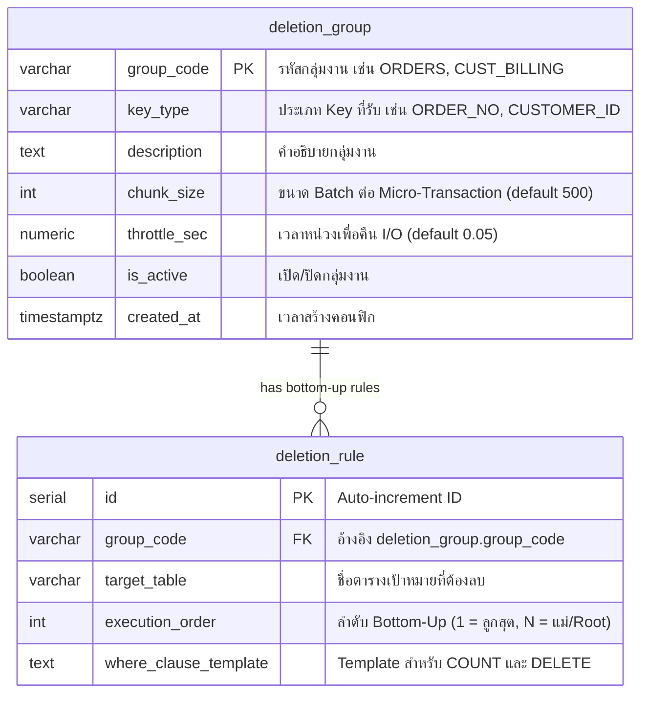
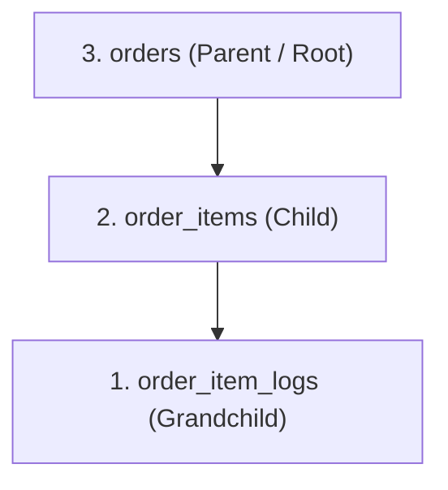
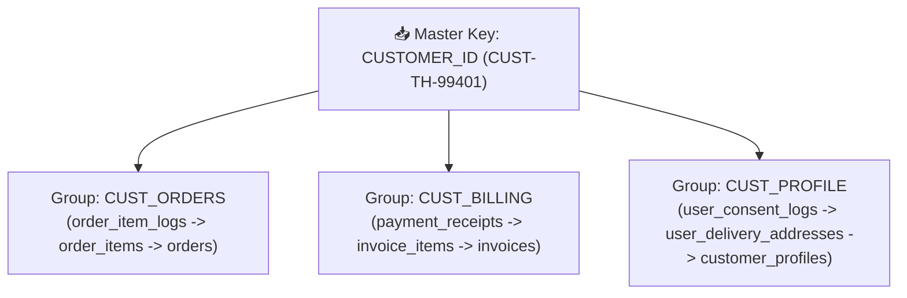
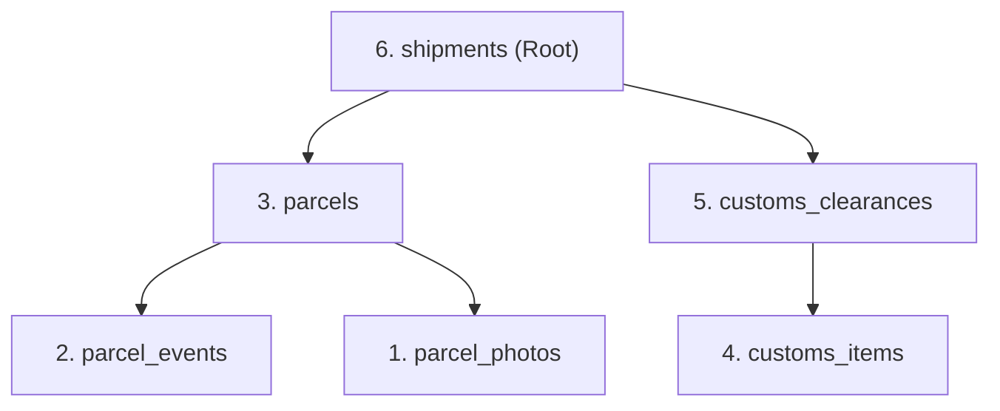

# Enterprise Configuration Guide: Deletion Groups & Rules
### คู่มือการตั้งค่าตารางคอนฟิกสำหรับกรณีการใช้งานต่างๆ (Use Cases) โดยละเอียด
### พร้อมตัวอย่างข้อมูลในตาราง deletion_group และ deletion_rule ครบถ้วน
### Database: PostgreSQL 16 | Architecture: 2-Tier Item & Task System

---

## 1. บทนำและภาพรวมตารางคอนฟิก (Configuration Overview)

ระบบ Yearly Data Deletion ขับเคลื่อนด้วย Metadata-Driven Configuration สองตารางหลัก:



---

### 1.1 ตัวอย่างโครงสร้างและข้อมูลในตาราง `deletion_group`

ตาราง `deletion_group` ทำหน้าที่ควบคุม **"กลุ่มของชุดตาราง"** ที่สัมพันธ์กันทางธุรกิจ และเป็นตัวกำหนด Policy การประมวลผล (ขนาด Chunk และเวลาหน่วง Throttle):

| คอลัมน์ | ชนิดข้อมูล | คุณสมบัติ | คำอธิบายและความสำคัญ |
|---|---|---|---|
| `group_code` | `VARCHAR(50)` | **PK** | รหัสเฉพาะของกลุ่มตาราง เช่น `ORDERS`, `CUST_BILLING` |
| `key_type` | `VARCHAR(50)` | NOT NULL | ประเภทของ Identifier จากไฟล์ภายนอกที่กลุ่มนี้รับ เช่น `ORDER_NO`, `CUSTOMER_ID` |
| `description` | `TEXT` | NULL | คำอธิบายขอบเขตงาน นโยบายการจัดเก็บ หรือกฎหมายที่เกี่ยวข้อง |
| `chunk_size` | `INT` | Default `500` | จำนวน Keys ต่อ 1 Micro-Transaction (1 COMMIT) |
| `throttle_sec` | `NUMERIC(4,2)` | Default `0.05` | เวลาหยุดพัก (วินาที) หลังจบแต่ละ Chunk เพื่อคืน I/O ให้ระบบงานหลัก |
| `is_active` | `BOOLEAN` | Default `TRUE` | สวิตช์เปิด/ปิดกลุ่มงาน (หากเป็น `FALSE` งานในกลุ่มนี้จะถูกข้ามทันที) |
| `created_at` | `TIMESTAMPTZ` | Auto | เวลาที่สร้างเรคคอร์ด |

#### 📋 ตัวอย่างข้อมูลจริงในตาราง `deletion_group`:
| group_code | key_type | chunk_size | throttle_sec | is_active | description |
|---|---|---|---|---|---|
| `ORDERS_STANDARD` | `ORDER_NO` | 500 | 0.05 | `true` | Standard 3-tier order history deletion (5-year retention) |
| `CUST_ORDERS` | `CUSTOMER_ID` | 500 | 0.05 | `true` | PDPA Purge: Customer order history |
| `CUST_BILLING` | `CUSTOMER_ID` | 500 | 0.05 | `true` | PDPA Purge: Customer billing & payments |
| `CUST_PROFILE` | `CUSTOMER_ID` | 200 | 0.05 | `true` | PDPA Purge: Customer personal profile & consents |
| `FINANCIAL_LEDGER` | `TX_UUID` | 300 | 0.10 | `true` | Financial ledger purge with UUID type casting |
| `API_GATEWAY_TELEMETRY`| `SESSION_TOKEN`| 2000 | 0.01 | `true` | High-throughput purge for flat telemetry & access logs |

---

### 1.2 ตัวอย่างโครงสร้างและข้อมูลในตาราง `deletion_rule`

ตาราง `deletion_rule` ทำหน้าที่กำหนด **"ลำดับขั้นการลบแบบ Bottom-Up"** และ **"เงื่อนไข SQL Template"** ที่ใช้จริง:

| คอลัมน์ | ชนิดข้อมูล | คุณสมบัติ | คำอธิบายและความสำคัญ |
|---|---|---|---|
| `id` | `SERIAL` | **PK** | รหัส Auto-increment |
| `group_code` | `VARCHAR(50)` | **FK** | ชี้ไปยัง `deletion_group.group_code` |
| `target_table` | `VARCHAR(100)` | NOT NULL | ชื่อตารางในฐานข้อมูลที่จะทำการลบข้อมูล |
| `execution_order` | `INT` | NOT NULL | ลำดับการลบจากล่างขึ้นบน: **1 = ตารางลูก/หลานสุด $\rightarrow$ N = ตารางแม่/Root** |
| `where_clause_template`| `TEXT` | NOT NULL | เงื่อนไข WHERE โดย `$1` คือ Array ของ Master Key (`VARCHAR[]`) |

> [!IMPORTANT]
> **หลักการ Unified WHERE Clause:** เงื่อนไข `where_clause_template` ตัวเดียวกันนี้ ถูกนำไปใช้ทั้งคำสั่งนับประเมินยอดใน Dry Run (`SELECT COUNT(*) FROM <target_table> <where_clause_template>`) และคำสั่งลบจริงใน Real Deletion (`DELETE FROM <target_table> <where_clause_template>`) เพื่อรับประกันความถูกต้องแม่นยำ 100%

#### 📋 ตัวอย่างข้อมูลจริงในตาราง `deletion_rule`:
| id | group_code | target_table | execution_order | where_clause_template |
|---|---|---|---|---|
| 1 | `ORDERS_STANDARD` | `order_item_logs` | **1 (หลานสุด)** | `WHERE item_id IN (SELECT id FROM order_items WHERE order_no = ANY($1))` |
| 2 | `ORDERS_STANDARD` | `order_items` | **2 (ลูก)** | `WHERE order_no = ANY($1)` |
| 3 | `ORDERS_STANDARD` | `orders` | **3 (แม่/Root)** | `WHERE order_no = ANY($1)` |
| 4 | `CUST_BILLING` | `payment_receipts`| **1 (หลานสุด)** | `WHERE invoice_id IN (SELECT id FROM invoices WHERE customer_id = ANY($1))` |
| 5 | `CUST_BILLING` | `invoice_items` | **2 (ลูก)** | `WHERE invoice_id IN (SELECT id FROM invoices WHERE customer_id = ANY($1))` |
| 6 | `CUST_BILLING` | `invoices` | **3 (แม่/Root)** | `WHERE customer_id = ANY($1)` |

---

## 2. ตัวอย่างการตั้งค่าแยกตาม Use Cases โดยละเอียด

---

### 📦 Use Case 1: Standard 3-Tier Hierarchy (E-Commerce Orders)

**บริบท:** ลบประวัติคำสั่งซื้อและรายการสินค้าที่ปิดรอบบัญชีเกิน 5 ปี (หลาน $\rightarrow$ ลูก $\rightarrow$ แม่)  
**โครงสร้างลำดับชั้น:**


#### 1. คำสั่ง SQL สำหรับบันทึกคอนฟิก:
```sql
-- สร้าง Group
INSERT INTO deletion_group (group_code, key_type, description, chunk_size, throttle_sec, is_active)
VALUES ('ORDERS_STANDARD', 'ORDER_NO', 'Standard 3-tier order history deletion', 500, 0.05, TRUE);

-- สร้าง Rules (Bottom-Up 1 -> 2 -> 3)
INSERT INTO deletion_rule (group_code, target_table, execution_order, where_clause_template)
VALUES
    ('ORDERS_STANDARD', 'order_item_logs', 1, 
     'WHERE item_id IN (SELECT id FROM order_items WHERE order_no = ANY($1))'),
    ('ORDERS_STANDARD', 'order_items', 2, 
     'WHERE order_no = ANY($1)'),
    ('ORDERS_STANDARD', 'orders', 3, 
     'WHERE order_no = ANY($1)');
```

#### 2. ตัวอย่างเรคคอร์ดที่จัดเก็บในตารางคอนฟิก:

* **ตาราง `deletion_group`:**
  | group_code | key_type | chunk_size | throttle_sec | is_active | description |
  |---|---|---|---|---|---|
  | `ORDERS_STANDARD` | `ORDER_NO` | 500 | 0.05 | `true` | Standard 3-tier order history deletion |

* **ตาราง `deletion_rule`:**
  | id | group_code | target_table | execution_order | where_clause_template |
  |---|---|---|---|---|
  | 1 | `ORDERS_STANDARD` | `order_item_logs` | 1 | `WHERE item_id IN (SELECT id FROM order_items WHERE order_no = ANY($1))` |
  | 2 | `ORDERS_STANDARD` | `order_items` | 2 | `WHERE order_no = ANY($1)` |
  | 3 | `ORDERS_STANDARD` | `orders` | 3 | `WHERE order_no = ANY($1)` |

#### 3. ดัชนีที่จำเป็น (Required Indexes):
```sql
CREATE INDEX IF NOT EXISTS idx_orders_order_no ON orders(order_no);
CREATE INDEX IF NOT EXISTS idx_order_items_order_no ON order_items(order_no);
CREATE INDEX IF NOT EXISTS idx_order_item_logs_item_id ON order_item_logs(item_id);
```

#### 4. ตัวอย่างข้อมูลในแต่ละขั้นตอน (Data Flow Example):
* **ไฟล์นำเข้า:** `ORDER_NO,ORD-2019-10001`
* **ข้อมูลผลลัพธ์ Dry Run ใน `deletion_dry_run_summary`:**
  ```text
    target_table   | execution_order | estimated_rows_to_delete 
  -----------------+-----------------+--------------------------
   order_item_logs |               1 |                        6 
   order_items     |               2 |                        4 
   orders          |               3 |                        2 
  ```

---

### 👤 Use Case 2: 1:N Multi-Group Deletion (PDPA Right to be Forgotten)

**บริบท:** ลูกค้าขอลบข้อมูลตามสิทธิ PDPA โดยส่งเฉพาะ `CUSTOMER_ID` เข้ามาเพียงคีย์เดียว ระบบแตกงาน (Task Expansion) อัตโนมัติไปลบ 3 กลุ่มตารางอิสระ  
**โครงสร้างการกระจายงาน (1:N):**


#### 1. คำสั่ง SQL สำหรับบันทึกคอนฟิก:
```sql
-- สร้าง 3 กลุ่มตารางที่รับ key_type = 'CUSTOMER_ID' เหมือนกัน
INSERT INTO deletion_group (group_code, key_type, description, chunk_size, throttle_sec, is_active)
VALUES 
    ('CUST_ORDERS',  'CUSTOMER_ID', 'PDPA Purge: Customer order history', 500, 0.05, TRUE),
    ('CUST_BILLING', 'CUSTOMER_ID', 'PDPA Purge: Customer billing & payments', 500, 0.05, TRUE),
    ('CUST_PROFILE', 'CUSTOMER_ID', 'PDPA Purge: Customer personal profile & consents', 200, 0.05, TRUE);

-- [กลุ่มที่ 1: CUST_ORDERS]
INSERT INTO deletion_rule (group_code, target_table, execution_order, where_clause_template)
VALUES
    ('CUST_ORDERS', 'order_item_logs', 1, 
     'WHERE item_id IN (SELECT id FROM order_items WHERE order_no IN (SELECT order_no FROM orders WHERE customer_id = ANY($1)))'),
    ('CUST_ORDERS', 'order_items', 2, 
     'WHERE order_no IN (SELECT order_no FROM orders WHERE customer_id = ANY($1))'),
    ('CUST_ORDERS', 'orders', 3, 
     'WHERE customer_id = ANY($1)');

-- [กลุ่มที่ 2: CUST_BILLING]
INSERT INTO deletion_rule (group_code, target_table, execution_order, where_clause_template)
VALUES
    ('CUST_BILLING', 'payment_receipts', 1, 
     'WHERE invoice_id IN (SELECT id FROM invoices WHERE customer_id = ANY($1))'),
    ('CUST_BILLING', 'invoice_items', 2, 
     'WHERE invoice_id IN (SELECT id FROM invoices WHERE customer_id = ANY($1))'),
    ('CUST_BILLING', 'invoices', 3, 
     'WHERE customer_id = ANY($1)');

-- [กลุ่มที่ 3: CUST_PROFILE]
INSERT INTO deletion_rule (group_code, target_table, execution_order, where_clause_template)
VALUES
    ('CUST_PROFILE', 'user_consent_logs', 1, 'WHERE customer_id = ANY($1)'),
    ('CUST_PROFILE', 'user_delivery_addresses', 2, 'WHERE customer_id = ANY($1)'),
    ('CUST_PROFILE', 'customer_profiles', 3, 'WHERE customer_id = ANY($1)');
```

#### 2. ตัวอย่างเรคคอร์ดที่จัดเก็บในตารางคอนฟิก:

* **ตาราง `deletion_group` (3 Groups ผูกกับ 1 Key Type):**
  | group_code | key_type | chunk_size | throttle_sec | is_active | description |
  |---|---|---|---|---|---|
  | `CUST_ORDERS` | `CUSTOMER_ID` | 500 | 0.05 | `true` | PDPA Purge: Customer order history |
  | `CUST_BILLING` | `CUSTOMER_ID` | 500 | 0.05 | `true` | PDPA Purge: Customer billing & payments |
  | `CUST_PROFILE` | `CUSTOMER_ID` | 200 | 0.05 | `true` | PDPA Purge: Customer personal profile & consents |

* **ตาราง `deletion_rule` (9 Rules แยกตามกลุ่ม):**
  | id | group_code | target_table | execution_order | where_clause_template |
  |---|---|---|---|---|
  | 1 | `CUST_ORDERS` | `order_item_logs` | 1 | `WHERE item_id IN (SELECT id FROM order_items WHERE order_no IN (SELECT order_no FROM orders WHERE customer_id = ANY($1)))` |
  | 2 | `CUST_ORDERS` | `order_items` | 2 | `WHERE order_no IN (SELECT order_no FROM orders WHERE customer_id = ANY($1))` |
  | 3 | `CUST_ORDERS` | `orders` | 3 | `WHERE customer_id = ANY($1)` |
  | 4 | `CUST_BILLING` | `payment_receipts` | 1 | `WHERE invoice_id IN (SELECT id FROM invoices WHERE customer_id = ANY($1))` |
  | 5 | `CUST_BILLING` | `invoice_items` | 2 | `WHERE invoice_id IN (SELECT id FROM invoices WHERE customer_id = ANY($1))` |
  | 6 | `CUST_BILLING` | `invoices` | 3 | `WHERE customer_id = ANY($1)` |
  | 7 | `CUST_PROFILE` | `user_consent_logs` | 1 | `WHERE customer_id = ANY($1)` |
  | 8 | `CUST_PROFILE` | `user_delivery_addresses`| 2 | `WHERE customer_id = ANY($1)` |
  | 9 | `CUST_PROFILE` | `customer_profiles` | 3 | `WHERE customer_id = ANY($1)` |

#### 3. ตัวอย่างผลลัพธ์ Dry Run ใน `deletion_dry_run_summary`:
```text
       target_table       | execution_order | estimated_rows_to_delete 
--------------------------+-----------------+--------------------------
 order_item_logs          |               1 |                       15 
 order_items              |               2 |                        8 
 orders                   |               3 |                        3 
 payment_receipts         |               1 |                        3 
 invoice_items            |               2 |                        6 
 invoices                 |               3 |                        3 
 user_consent_logs        |               1 |                        4 
 user_delivery_addresses  |               2 |                        2 
 customer_profiles        |               3 |                        1 
```

---

### 🚚 Use Case 3: Deep Hierarchy with Multi-Branch FKs (Logistics & Supply Chain)

**บริบท:** ตาราง Root (`shipments`) มี Foreign Key แตกออกเป็น 2 กิ่ง: กิ่งพัสดุ (`parcels`) และกิ่งศุลกากร (`customs_clearances`)  
**โครงสร้างต้นไม้หลายกิ่ง (Multi-Branch Tree):**


#### 1. คำสั่ง SQL สำหรับบันทึกคอนฟิก:
```sql
INSERT INTO deletion_group (group_code, key_type, description, chunk_size, throttle_sec, is_active)
VALUES ('LOGISTICS_SHIPMENTS', 'SHIPMENT_NO', 'Multi-branch shipment hierarchy deletion', 250, 0.08, TRUE);

INSERT INTO deletion_rule (group_code, target_table, execution_order, where_clause_template)
VALUES
    -- Branch Parcels (ชั้นล่างสุด)
    ('LOGISTICS_SHIPMENTS', 'parcel_photos', 1,
     'WHERE parcel_id IN (SELECT id FROM parcels WHERE shipment_no = ANY($1))'),
    ('LOGISTICS_SHIPMENTS', 'parcel_events', 2,
     'WHERE parcel_id IN (SELECT id FROM parcels WHERE shipment_no = ANY($1))'),
    ('LOGISTICS_SHIPMENTS', 'parcels', 3,
     'WHERE shipment_no = ANY($1)'),

    -- Branch Customs (พิธีการศุลกากร)
    ('LOGISTICS_SHIPMENTS', 'customs_items', 4,
     'WHERE shipment_no = ANY($1)'),
    ('LOGISTICS_SHIPMENTS', 'customs_clearances', 5,
     'WHERE shipment_no = ANY($1)'),

    -- ตาราง Root
    ('LOGISTICS_SHIPMENTS', 'shipments', 6,
     'WHERE shipment_no = ANY($1)');
```

#### 2. ตัวอย่างเรคคอร์ดที่จัดเก็บในตารางคอนฟิก:

* **ตาราง `deletion_group`:**
  | group_code | key_type | chunk_size | throttle_sec | is_active | description |
  |---|---|---|---|---|---|
  | `LOGISTICS_SHIPMENTS` | `SHIPMENT_NO` | 250 | 0.08 | `true` | Multi-branch shipment hierarchy deletion |

* **ตาราง `deletion_rule` (6 ระดับ Bottom-Up):**
  | id | group_code | target_table | execution_order | where_clause_template |
  |---|---|---|---|---|
  | 1 | `LOGISTICS_SHIPMENTS` | `parcel_photos` | 1 | `WHERE parcel_id IN (SELECT id FROM parcels WHERE shipment_no = ANY($1))` |
  | 2 | `LOGISTICS_SHIPMENTS` | `parcel_events` | 2 | `WHERE parcel_id IN (SELECT id FROM parcels WHERE shipment_no = ANY($1))` |
  | 3 | `LOGISTICS_SHIPMENTS` | `parcels` | 3 | `WHERE shipment_no = ANY($1)` |
  | 4 | `LOGISTICS_SHIPMENTS` | `customs_items` | 4 | `WHERE shipment_no = ANY($1)` |
  | 5 | `LOGISTICS_SHIPMENTS` | `customs_clearances` | 5 | `WHERE shipment_no = ANY($1)` |
  | 6 | `LOGISTICS_SHIPMENTS` | `shipments` | 6 | `WHERE shipment_no = ANY($1)` |

---

### 💳 Use Case 4: UUID & Explicit Type-Casting (Financial Transactions)

**บริบท:** คอลัมน์ Primary/Foreign Key ในระบบการเงินถูกเก็บเป็นประเภท `UUID` ใน PostgreSQL  
**เทคนิค:** ใส่ **`$1::uuid[]`** ใน `where_clause_template` เพื่อป้องกัน Type Coercion:

#### 1. คำสั่ง SQL สำหรับบันทึกคอนฟิก:
```sql
INSERT INTO deletion_group (group_code, key_type, description, chunk_size, throttle_sec, is_active)
VALUES ('FINANCIAL_LEDGER', 'TX_UUID', 'Financial ledger purge with UUID casting', 300, 0.10, TRUE);

INSERT INTO deletion_rule (group_code, target_table, execution_order, where_clause_template)
VALUES
    ('FINANCIAL_LEDGER', 'ledger_entry_audit_logs', 1,
     'WHERE entry_id IN (SELECT id FROM ledger_entries WHERE tx_uuid = ANY($1::uuid[]))'),
    ('FINANCIAL_LEDGER', 'ledger_entries', 2,
     'WHERE tx_uuid = ANY($1::uuid[])'),
    ('FINANCIAL_LEDGER', 'transactions', 3,
     'WHERE tx_uuid = ANY($1::uuid[])');
```

#### 2. ตัวอย่างเรคคอร์ดที่จัดเก็บในตารางคอนฟิก:

* **ตาราง `deletion_group`:**
  | group_code | key_type | chunk_size | throttle_sec | is_active | description |
  |---|---|---|---|---|---|
  | `FINANCIAL_LEDGER` | `TX_UUID` | 300 | 0.10 | `true` | Financial ledger purge with UUID casting |

* **ตาราง `deletion_rule`:**
  | id | group_code | target_table | execution_order | where_clause_template |
  |---|---|---|---|---|
  | 1 | `FINANCIAL_LEDGER` | `ledger_entry_audit_logs` | 1 | `WHERE entry_id IN (SELECT id FROM ledger_entries WHERE tx_uuid = ANY($1::uuid[]))` |
  | 2 | `FINANCIAL_LEDGER` | `ledger_entries` | 2 | `WHERE tx_uuid = ANY($1::uuid[])` |
  | 3 | `FINANCIAL_LEDGER` | `transactions` | 3 | `WHERE tx_uuid = ANY($1::uuid[])` |

---

### ⚡ Use Case 5: Single Standalone Table with High Volume (Telemetry Logs)

**บริบท:** ลบตาราง Log/Audit ขนาดใหญ่หลายสิบล้านแถวที่เป็นตารางเดี่ยว (Flat Table ไม่มี Foreign Key)  
**เป้าหมาย:** ปรับจูนให้ได้ความเร็วสูงสุด (Chunk = 2,000, Throttle = 10ms)

#### 1. คำสั่ง SQL สำหรับบันทึกคอนฟิก:
```sql
INSERT INTO deletion_group (group_code, key_type, description, chunk_size, throttle_sec, is_active)
VALUES ('API_GATEWAY_TELEMETRY', 'SESSION_TOKEN', 'High-throughput flat telemetry purge', 2000, 0.01, TRUE);

INSERT INTO deletion_rule (group_code, target_table, execution_order, where_clause_template)
VALUES
    ('API_GATEWAY_TELEMETRY', 'api_access_logs', 1,
     'WHERE session_token = ANY($1)');
```

#### 2. ตัวอย่างเรคคอร์ดที่จัดเก็บในตารางคอนฟิก:

* **ตาราง `deletion_group`:**
  | group_code | key_type | chunk_size | throttle_sec | is_active | description |
  |---|---|---|---|---|---|
  | `API_GATEWAY_TELEMETRY` | `SESSION_TOKEN` | 2000 | 0.01 | `true` | High-throughput flat telemetry purge |

* **ตาราง `deletion_rule`:**
  | id | group_code | target_table | execution_order | where_clause_template |
  |---|---|---|---|---|
  | 1 | `API_GATEWAY_TELEMETRY` | `api_access_logs` | 1 | `WHERE session_token = ANY($1)` |

---

### 🛡️ Use Case 6: Composite Date Retention Safeguard (Extra Safeguard Filter)

**บริบท:** ป้องกัน Human Error ในกรณีที่ไฟล์ Excel มีคีย์ของปีปัจจุบันปนมา โดยบังคับในระดับฐานข้อมูลว่า *“ต้องเป็นคีย์ที่ระบุ และข้อมูลต้องมีอายุเก่ากว่า 7 ปีเท่านั้น”*:

#### 1. คำสั่ง SQL สำหรับบันทึกคอนฟิก:
```sql
INSERT INTO deletion_group (group_code, key_type, description, chunk_size, throttle_sec, is_active)
VALUES ('INVOICES_CLOSED_YEAR', 'INVOICE_NO', 'Invoice purge with date safeguard filter', 500, 0.05, TRUE);

INSERT INTO deletion_rule (group_code, target_table, execution_order, where_clause_template)
VALUES
    ('INVOICES_CLOSED_YEAR', 'invoice_attachment_files', 1, 'WHERE invoice_no = ANY($1)'),
    ('INVOICES_CLOSED_YEAR', 'invoice_line_items', 2, 'WHERE invoice_no = ANY($1)'),
    ('INVOICES_CLOSED_YEAR', 'invoices', 3,
     'WHERE invoice_no = ANY($1) AND created_at < (CURRENT_DATE - INTERVAL ''7 years'')');
```

#### 2. ตัวอย่างเรคคอร์ดที่จัดเก็บในตารางคอนฟิก:

* **ตาราง `deletion_group`:**
  | group_code | key_type | chunk_size | throttle_sec | is_active | description |
  |---|---|---|---|---|---|
  | `INVOICES_CLOSED_YEAR` | `INVOICE_NO` | 500 | 0.05 | `true` | Invoice purge with date safeguard filter |

* **ตาราง `deletion_rule`:**
  | id | group_code | target_table | execution_order | where_clause_template |
  |---|---|---|---|---|
  | 1 | `INVOICES_CLOSED_YEAR` | `invoice_attachment_files` | 1 | `WHERE invoice_no = ANY($1)` |
  | 2 | `INVOICES_CLOSED_YEAR` | `invoice_line_items` | 2 | `WHERE invoice_no = ANY($1)` |
  | 3 | `INVOICES_CLOSED_YEAR` | `invoices` | 3 | `WHERE invoice_no = ANY($1) AND created_at < (CURRENT_DATE - INTERVAL '7 years')` |

---

## 3. Best Practices ในการกำหนดคอนฟิก (Configuration Best Practices)

| พารามิเตอร์ | ค่าที่แนะนำ (Default) | คำแนะนำในการปรับจูน |
|---|---|---|
| `chunk_size` | `500` | • **ตารางที่มีตารางลูกหลายระดับ (Deep FK):** ใช้ `200` - `300`<br/>• **ตารางเดี่ยว (Flat Table / Logs):** ปรับขึ้นได้ถึง `1,000` - `2,000` |
| `throttle_sec` | `0.05` (50ms) | • **เวลากลางวัน (Online Business Hours):** ใช้ `0.10` - `0.20` เพื่อลด Lock Contention<br/>• **ช่วง Maintenance Window (กลางคืน):** ปรับลงเหลือ `0.01` หรือ `0` |
| `is_active` | `TRUE` | ปรับเป็น `FALSE` ชั่วคราวเพื่อ Skip กลุ่มตารางนั้นได้ทันทีโดยไม่ต้องลบ Rules ออก |

---

## 4. ผลลัพธ์ข้อมูลจริงในฐานข้อมูลหลังรัน `sql/07_example_configurations.sql`

หลังจากรันสคริปต์ [`sql/07_example_configurations.sql`](file:///c:/KK/Workspace/AntigravityProject/data-deletion/sql/07_example_configurations.sql) ข้อมูลจริงในตารางคอนฟิกของ PostgreSQL จะปรากฏดังนี้:

### 4.1 ข้อมูลในตาราง `deletion_group` (กลุ่มงานทั้งหมด):

```sql
SELECT 
    g.group_code,
    g.key_type,
    g.chunk_size,
    g.throttle_sec,
    g.is_active,
    COUNT(r.id) AS total_rules,
    g.description
FROM deletion_group g
LEFT JOIN deletion_rule r ON r.group_code = g.group_code
GROUP BY g.group_code, g.key_type, g.chunk_size, g.throttle_sec, g.is_active, g.description
ORDER BY g.group_code;
```

**ผลลัพธ์ข้อมูลจริง (Live Query Output):**
```text
      group_code       |   key_type    | chunk_size | throttle_sec | is_active | total_rules |                        description                         
-----------------------+---------------+------------+--------------+-----------+-------------+------------------------------------------------------------
 API_GATEWAY_TELEMETRY | SESSION_TOKEN |       2000 |         0.01 | t         |           1 | High-throughput purge for flat telemetry & access logs
 CUST_BILLING          | CUSTOMER_ID   |        500 |         0.05 | t         |           3 | PDPA Purge: Customer billing & payments
 CUST_ORDERS           | CUSTOMER_ID   |        500 |         0.05 | t         |           3 | PDPA Purge: Customer order history
 CUST_PROFILE          | CUSTOMER_ID   |        200 |         0.05 | t         |           3 | PDPA Purge: Customer personal profile & consents
 FINANCIAL_LEDGER      | TX_UUID       |        300 |         0.10 | t         |           3 | Financial ledger purge with UUID type casting
 INVOICES              | INVOICE_NO    |        500 |         0.05 | t         |           2 | Yearly invoice data deletion
 INVOICES_CLOSED_YEAR  | INVOICE_NO    |        500 |         0.05 | t         |           3 | Invoice purge with date safety filter (older than 7 years)
 LOGISTICS_SHIPMENTS   | SHIPMENT_NO   |        250 |         0.08 | t         |           6 | Multi-branch shipment hierarchy deletion
 ORDERS                | ORDER_NO      |        500 |         0.05 | t         |           3 | Yearly order data deletion
 ORDERS_STANDARD       | ORDER_NO      |        500 |         0.05 | t         |           3 | Standard 3-tier order history deletion (5-year retention)
(10 rows)
```

---

### 4.2 ข้อมูลในตาราง `deletion_rule` (กฎการลบ Bottom-Up ทุกตาราง):

```sql
SELECT 
    r.group_code,
    g.key_type,
    r.execution_order,
    r.target_table,
    r.where_clause_template
FROM deletion_rule r
JOIN deletion_group g ON g.group_code = r.group_code
ORDER BY r.group_code, r.execution_order;
```

**ผลลัพธ์ข้อมูลจริง (Live Query Output):**
```text
      group_code       |   key_type    | execution_order |       target_table       |                                                   where_clause_template                                                   
-----------------------+---------------+-----------------+--------------------------+---------------------------------------------------------------------------------------------------------------------------
 API_GATEWAY_TELEMETRY | SESSION_TOKEN |               1 | api_access_logs          | WHERE session_token = ANY($1)
 CUST_BILLING          | CUSTOMER_ID   |               1 | payment_receipts         | WHERE invoice_id IN (SELECT id FROM invoices WHERE customer_id = ANY($1))
 CUST_BILLING          | CUSTOMER_ID   |               2 | invoice_items            | WHERE invoice_id IN (SELECT id FROM invoices WHERE customer_id = ANY($1))
 CUST_BILLING          | CUSTOMER_ID   |               3 | invoices                 | WHERE customer_id = ANY($1)
 CUST_ORDERS           | CUSTOMER_ID   |               1 | order_item_logs          | WHERE item_id IN (SELECT id FROM order_items WHERE order_no IN (SELECT order_no FROM orders WHERE customer_id = ANY($1)))
 CUST_ORDERS           | CUSTOMER_ID   |               2 | order_items              | WHERE order_no IN (SELECT order_no FROM orders WHERE customer_id = ANY($1))
 CUST_ORDERS           | CUSTOMER_ID   |               3 | orders                   | WHERE customer_id = ANY($1)
 CUST_PROFILE          | CUSTOMER_ID   |               1 | user_consent_logs        | WHERE customer_id = ANY($1)
 CUST_PROFILE          | CUSTOMER_ID   |               2 | user_delivery_addresses  | WHERE customer_id = ANY($1)
 CUST_PROFILE          | CUSTOMER_ID   |               3 | customer_profiles        | WHERE customer_id = ANY($1)
 FINANCIAL_LEDGER      | TX_UUID       |               1 | ledger_entry_audit_logs  | WHERE entry_id IN (SELECT id FROM ledger_entries WHERE tx_uuid = ANY($1::uuid[]))
 FINANCIAL_LEDGER      | TX_UUID       |               2 | ledger_entries           | WHERE tx_uuid = ANY($1::uuid[])
 FINANCIAL_LEDGER      | TX_UUID       |               3 | transactions             | WHERE tx_uuid = ANY($1::uuid[])
 INVOICES              | INVOICE_NO    |               1 | invoice_items            | WHERE invoice_no = ANY($1)
 INVOICES              | INVOICE_NO    |               2 | invoices                 | WHERE invoice_no = ANY($1)
 INVOICES_CLOSED_YEAR  | INVOICE_NO    |               1 | invoice_attachment_files | WHERE invoice_no = ANY($1)
 INVOICES_CLOSED_YEAR  | INVOICE_NO    |               2 | invoice_line_items       | WHERE invoice_no = ANY($1)
 INVOICES_CLOSED_YEAR  | INVOICE_NO    |               3 | invoices                 | WHERE invoice_no = ANY($1) AND created_at < (CURRENT_DATE - INTERVAL '7 years')
 LOGISTICS_SHIPMENTS   | SHIPMENT_NO   |               1 | parcel_photos            | WHERE parcel_id IN (SELECT id FROM parcels WHERE shipment_no = ANY($1))
 LOGISTICS_SHIPMENTS   | SHIPMENT_NO   |               2 | parcel_events            | WHERE parcel_id IN (SELECT id FROM parcels WHERE shipment_no = ANY($1))
 LOGISTICS_SHIPMENTS   | SHIPMENT_NO   |               3 | parcels                  | WHERE shipment_no = ANY($1)
 LOGISTICS_SHIPMENTS   | SHIPMENT_NO   |               4 | customs_items            | WHERE shipment_no = ANY($1)
 LOGISTICS_SHIPMENTS   | SHIPMENT_NO   |               5 | customs_clearances       | WHERE shipment_no = ANY($1)
 LOGISTICS_SHIPMENTS   | SHIPMENT_NO   |               6 | shipments                | WHERE shipment_no = ANY($1)
 ORDERS                | ORDER_NO      |               1 | order_item_logs          | WHERE item_id IN (SELECT id FROM order_items WHERE order_no = ANY($1))
 ORDERS                | ORDER_NO      |               2 | order_items              | WHERE order_no = ANY($1)
 ORDERS                | ORDER_NO      |               3 | orders                   | WHERE order_no = ANY($1)
 ORDERS_STANDARD       | ORDER_NO      |               1 | order_item_logs          | WHERE item_id IN (SELECT id FROM order_items WHERE order_no = ANY($1))
 ORDERS_STANDARD       | ORDER_NO      |               2 | order_items              | WHERE order_no = ANY($1)
 ORDERS_STANDARD       | ORDER_NO      |               3 | orders                   | WHERE order_no = ANY($1)
(30 rows)
```
