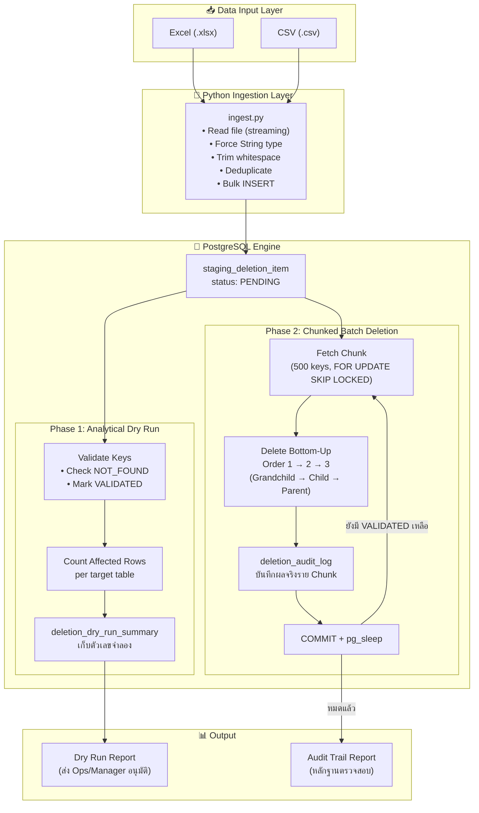
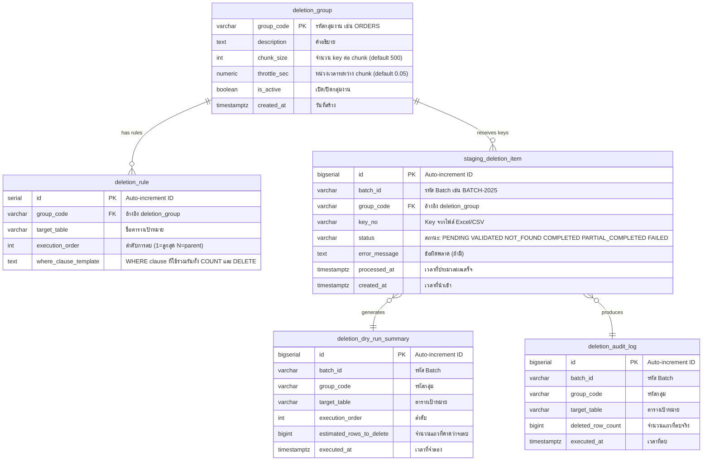
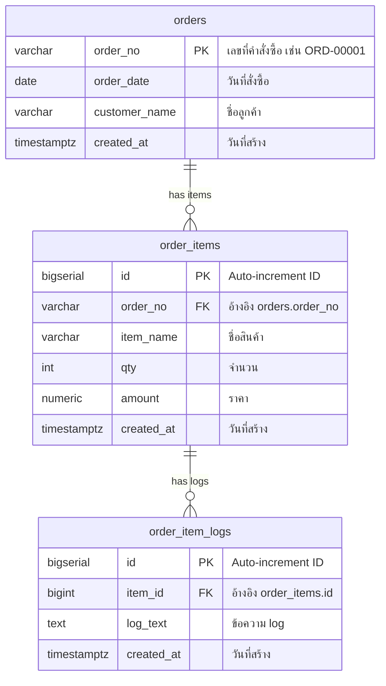
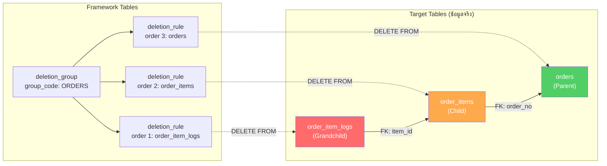
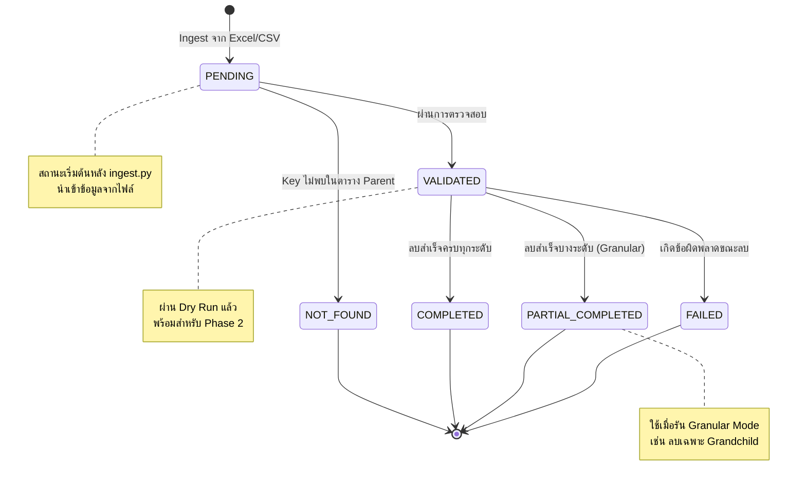
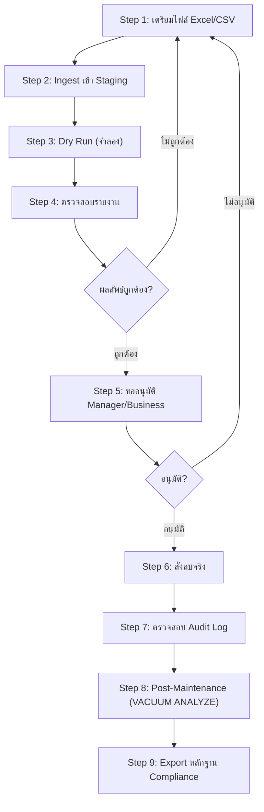

# Technical Specification: Yearly Data Deletion System
### Version 1.0 | PostgreSQL 16 | 2026-09-20

---

## 1. System Overview

ระบบ **Yearly Data Deletion** ออกแบบมาเพื่อลบข้อมูลที่ปิดรอบบัญชีประจำปีจากฐานข้อมูล PostgreSQL อย่างปลอดภัย โดยรองรับ:
- ข้อมูลที่มีความสัมพันธ์แบบ Parent-Child หลายระดับ (Multi-level Hierarchy)
- ข้อมูลหลักแสนรายการต่อปี
- การลบแบบ Micro-Transaction (ทีละ Chunk) ไม่ Lock ทั้ง Table
- Dry Run เพื่อจำลองผลลัพธ์ก่อนลบจริง
- Audit Trail สำหรับการตรวจสอบย้อนหลัง

---

## 2. System Architecture



---

## 3. Entity-Relationship Diagram

### 3.1 Framework Tables (ตารางระบบ Deletion)



### 3.2 Mock Tables (ตัวอย่างตารางเป้าหมาย 3 ระดับ)



### 3.3 ความสัมพันธ์ระหว่าง Framework กับ Target Tables



---

## 4. Staging Item State Machine



---

## 5. Database Schema Reference

### 5.1 `deletion_group` — กลุ่มงานลบข้อมูล

| Column | Type | Nullable | Default | Description |
|---|---|---|---|---|
| `group_code` | `VARCHAR(50)` | NOT NULL | — | **PK.** รหัสกลุ่ม เช่น `ORDERS`, `TRANSACTIONS` |
| `description` | `TEXT` | NULL | — | คำอธิบายกลุ่มงาน |
| `chunk_size` | `INT` | NOT NULL | `500` | จำนวน key ที่ประมวลผลต่อ 1 chunk (1 transaction) |
| `throttle_sec` | `NUMERIC(4,2)` | NOT NULL | `0.05` | เวลาหน่วง (วินาที) ระหว่าง chunk เพื่อคืน I/O |
| `is_active` | `BOOLEAN` | NOT NULL | `TRUE` | เปิด/ปิดกลุ่มงาน |
| `created_at` | `TIMESTAMPTZ` | NOT NULL | `CURRENT_TIMESTAMP` | เวลาสร้าง |

### 5.2 `deletion_rule` — กฎการลบ (Unified WHERE Clause)

| Column | Type | Nullable | Default | Description |
|---|---|---|---|---|
| `id` | `SERIAL` | NOT NULL | Auto | **PK.** Auto-increment |
| `group_code` | `VARCHAR(50)` | NOT NULL | — | **FK** → `deletion_group.group_code` |
| `target_table` | `VARCHAR(100)` | NOT NULL | — | ชื่อตารางเป้าหมายที่จะลบ |
| `execution_order` | `INT` | NOT NULL | — | ลำดับ Bottom-Up: **1 = ลูกสุด, N = Parent** |
| `where_clause_template` | `TEXT` | NOT NULL | — | WHERE clause ที่ `$1` = Array ของ Parent Key |

> **Unique Constraint:** `(group_code, execution_order)` — แต่ละกลุ่มมีลำดับการลบไม่ซ้ำกัน  
> **หลักการ Unified WHERE:** ฟิลด์ `where_clause_template` ถูกใช้ทั้ง Dry Run (COUNT) และ Real Delete (DELETE) เพื่อรับประกันว่าผลลัพธ์ตรงกัน 100%

### 5.3 `staging_deletion_item` — รายการ Key จากไฟล์

| Column | Type | Nullable | Default | Description |
|---|---|---|---|---|
| `id` | `BIGSERIAL` | NOT NULL | Auto | **PK** |
| `batch_id` | `VARCHAR(50)` | NOT NULL | — | รหัส Batch เช่น `BATCH-2025` |
| `group_code` | `VARCHAR(50)` | NOT NULL | — | **FK** → `deletion_group.group_code` |
| `key_no` | `VARCHAR(100)` | NOT NULL | — | Key ที่ต้องการลบ (จากไฟล์) |
| `status` | `VARCHAR(30)` | NOT NULL | `PENDING` | สถานะปัจจุบัน (ดู State Machine) |
| `error_message` | `TEXT` | NULL | — | ข้อผิดพลาด (เมื่อ status = FAILED) |
| `processed_at` | `TIMESTAMPTZ` | NULL | — | เวลาที่ประมวลผลเสร็จ |
| `created_at` | `TIMESTAMPTZ` | NOT NULL | `CURRENT_TIMESTAMP` | เวลานำเข้า |

**Index:** `idx_staging_fetch ON (group_code, batch_id, status, id)` — เพื่อประสิทธิภาพในการดึง Chunk

### 5.4 `deletion_dry_run_summary` — สรุปผล Dry Run

| Column | Type | Description |
|---|---|---|
| `id` | `BIGSERIAL` | **PK** |
| `batch_id` | `VARCHAR(50)` | รหัส Batch |
| `group_code` | `VARCHAR(50)` | รหัสกลุ่ม |
| `target_table` | `VARCHAR(100)` | ตารางเป้าหมาย |
| `execution_order` | `INT` | ลำดับ |
| `estimated_rows_to_delete` | `BIGINT` | จำนวนแถวที่คาดว่าจะถูกลบ |
| `executed_at` | `TIMESTAMPTZ` | เวลาที่จำลอง |

### 5.5 `deletion_audit_log` — บันทึกผลการลบจริง

| Column | Type | Description |
|---|---|---|
| `id` | `BIGSERIAL` | **PK** |
| `batch_id` | `VARCHAR(50)` | รหัส Batch |
| `group_code` | `VARCHAR(50)` | รหัสกลุ่ม |
| `target_table` | `VARCHAR(100)` | ตารางที่ลบ |
| `deleted_row_count` | `BIGINT` | จำนวนแถวที่ลบจริงใน Chunk นี้ |
| `executed_at` | `TIMESTAMPTZ` | เวลาที่ลบ |

---

## 6. Stored Procedures Reference

### 6.1 `run_data_deletion_dry_run` (Phase 1)

**วัตถุประสงค์:** จำลองการลบ (Count Only) โดยไม่ลบข้อมูลจริง **รองรับการรันทุกกลุ่มงาน (ALL groups) ในคำสั่งเดียว**

```sql
CALL run_data_deletion_dry_run(
    p_batch_id       VARCHAR,              -- รหัส Batch เช่น 'BATCH-2025'
    p_group_code     VARCHAR DEFAULT NULL,  -- NULL = รันทุกกลุ่มงานใน Batch นี้อัตโนมัติ!
    p_parent_table   VARCHAR DEFAULT NULL,  -- Optional override (ปกติอ่านจาก deletion_group อัตโนมัติ)
    p_parent_key_col VARCHAR DEFAULT NULL   -- Optional override
);
```

**รูปแบบการเรียกใช้งาน:**
- **รันทุกกลุ่มงานในคำสั่งเดียว (Single-Command All Groups):**
  ```sql
  CALL run_data_deletion_dry_run('BATCH-2025');
  ```
- **รันเฉพาะกลุ่มที่ต้องการ:**
  ```sql
  CALL run_data_deletion_dry_run('BATCH-2025', 'ORDERS');
  ```

**ขั้นตอนการทำงาน:**
1. ตรวจหาทุก `group_code` ที่มีรายการอยู่ใน Batch นี้ (หากไม่ระบุ `p_group_code`)
2. วน Loop ทีละกลุ่มงาน โดยอ่าน `parent_table` และ `parent_key_col` จาก `deletion_group` อัตโนมัติ
3. ตรวจสอบ Key ที่ไม่มีอยู่ในตาราง Parent → อัปเดตเป็น `NOT_FOUND`
4. Key ที่เหลือทั้งหมด → อัปเดตเป็น `VALIDATED`
5. วนนับแถวที่จะโดนกระทบในแต่ละตารางตาม `deletion_rule` ของกลุ่มนั้น
6. บันทึกผลลงตาราง `deletion_dry_run_summary`
7. พิมพ์สรุปผลทุกกลุ่มงานผ่าน `RAISE NOTICE`

---

### 6.2 `run_data_deletion` (Phase 2)

**วัตถุประสงค์:** ลบข้อมูลจริงแบบ Chunk-by-Chunk ตามลำดับ Bottom-Up **รองรับการลบทุกกลุ่มงาน (ALL groups) ในคำสั่งเดียว**

```sql
CALL run_data_deletion(
    p_batch_id     VARCHAR,              -- รหัส Batch
    p_group_code   VARCHAR DEFAULT NULL,  -- NULL = ลบทุกกลุ่มงานใน Batch นี้อัตโนมัติ!
    p_up_to_order  INT     DEFAULT NULL   -- ลบถึงระดับไหน (NULL = ทุกระดับ)
);
```

**รูปแบบการเรียกใช้งาน:**
- **สั่งลบทุกกลุ่มงานในคำสั่งเดียว (Single-Command All Groups):**
  ```sql
  CALL run_data_deletion('BATCH-2025');
  ```
- **สั่งลบเฉพาะกลุ่มที่ต้องการ:**
  ```sql
  CALL run_data_deletion('BATCH-2025', 'ORDERS');
  ```
- **สั่งลบเฉพาะระดับล่าง (Granular Mode):**
  ```sql
  CALL run_data_deletion('BATCH-2025', 'ORDERS', 1); -- ลบเฉพาะ Grandchild
  ```

**Parameter `p_up_to_order`:**

| ค่า | ลำดับที่ลบ | ตัวอย่าง (ORDERS group) |
|---|---|---|
| `NULL` | ลบครบทุกระดับ | `order_item_logs` → `order_items` → `orders` |
| `2` | ลบถึง Child | `order_item_logs` → `order_items` |
| `1` | ลบเฉพาะ Grandchild | `order_item_logs` เท่านั้น |

> ระบบ **ไม่อนุญาต** ให้ข้ามลำดับ — หากระบุ `p_up_to_order = 3` (Parent) ระบบจะลบ order 1 → 2 → 3 ตามลำดับเสมอ ป้องกัน FK Violation

---

## 7. Configuration Manual (คู่มือการตั้งค่า)

### 7.1 ขั้นตอนที่ 1: สร้าง Deletion Group

```sql
INSERT INTO deletion_group (group_code, description, chunk_size, throttle_sec)
VALUES ('ORDERS', 'Yearly order data deletion', 500, 0.05);
```

| Parameter | คำแนะนำ | เหตุผล |
|---|---|---|
| `chunk_size` = 200-500 | ข้อมูล **หลักหมื่น** keys | สมดุลระหว่างความเร็วและ Load |
| `chunk_size` = 500-1000 | ข้อมูล **หลักแสน** keys | เพิ่ม throughput แต่ WAL/Dead Tuple สูงขึ้น |
| `throttle_sec` = 0.05 | ระบบ **มี Read Replica** | ให้เวลา Replica ตามทัน |
| `throttle_sec` = 0 | ระบบ **ไม่มี Replica** | ไม่ต้องหน่วง ลบเร็วสุด |

### 7.2 ขั้นตอนที่ 2: กำหนด Deletion Rules

`execution_order` ต้องเรียงจาก **ลูกสุด (1) ไปหา Parent (N)** เสมอ  
ใน `where_clause_template` ตัว `$1` คือ Array ของ Parent Key

#### ตัวอย่าง A: ตารางที่ Child มี FK ตรงกับ Parent Key
```sql
INSERT INTO deletion_rule (group_code, target_table, execution_order, where_clause_template)
VALUES
    ('SIMPLE_ORDERS', 'order_items', 1, 'WHERE order_no = ANY($1)'),
    ('SIMPLE_ORDERS', 'orders',      2, 'WHERE order_no = ANY($1)');
```

#### ตัวอย่าง B: ตารางที่ Grandchild ต้อง JOIN ผ่าน Child
```sql
INSERT INTO deletion_rule (group_code, target_table, execution_order, where_clause_template)
VALUES
    ('ORDERS', 'order_item_logs', 1,
     'WHERE item_id IN (SELECT id FROM order_items WHERE order_no = ANY($1))'),
    ('ORDERS', 'order_items', 2,
     'WHERE order_no = ANY($1)'),
    ('ORDERS', 'orders', 3,
     'WHERE order_no = ANY($1)');
```

#### ตัวอย่าง C: ตารางที่มี 4 ระดับ
```sql
INSERT INTO deletion_rule (group_code, target_table, execution_order, where_clause_template)
VALUES
    ('CUSTOMERS', 'payments', 1,
     'WHERE invoice_id IN (SELECT invoice_id FROM invoices WHERE contract_id IN (SELECT contract_id FROM contracts WHERE customer_id = ANY($1)))'),
    ('CUSTOMERS', 'invoices', 2,
     'WHERE contract_id IN (SELECT contract_id FROM contracts WHERE customer_id = ANY($1))'),
    ('CUSTOMERS', 'contracts', 3,
     'WHERE customer_id = ANY($1)'),
    ('CUSTOMERS', 'customers', 4,
     'WHERE customer_id = ANY($1)');
```

---

## 8. Operational Workflow



---

## 9. Example Test Results

### ข้อมูลตั้งต้น
- `orders`: 10,000 แถว
- `order_items`: 30,000 แถว (3 items/order)
- `order_item_logs`: 60,000 แถว (2 logs/item)
- `sample_keys.csv`: 2,000 keys

### ผลลัพธ์จริงหลังทดสอบครบถ้วน
| Table | Before | After Granular (Order 1) | After Full Delete | Deleted Total |
|---|---|---|---|---|
| `orders` | 10,000 | 10,000 | **8,000** | 2,000 |
| `order_items` | 30,000 | 30,000 | **24,000** | 6,000 |
| `order_item_logs` | 60,000 | **48,000** | **48,000** | 12,000 |

- **Granular mode**: ลบเฉพาะ `order_item_logs` (12,000 แถว) โดย `order_items` และ `orders` ไม่ถูกแตะ
- **Full mode**: ลบ `order_items` (6,000 แถว) และ `orders` (2,000 แถว) ครบถ้วนโดยไม่เกิด Foreign Key Violation
