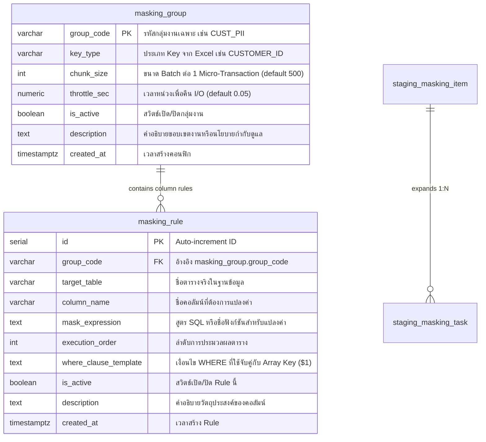

# Enterprise Configuration Guide: Key-Driven Data Masking System
### คู่มือการตั้งค่าตารางคอนฟิกสำหรับระบบ Data Masking อย่างละเอียดระดับองค์กร
### สถาปัตยกรรม Metadata-Driven Masking Expression ผ่านตาราง `masking_group` และ `masking_rule`
### Database: PostgreSQL 16+ | Model: Key-Driven 2-Tier Item & Column Rule Engine

---

## 1. ภาพรวมและปรัชญาการออกแบบ (Architectural Philosophy)

ระบบ **Key-Driven Data Masking System** ถูกออกแบบขึ้นมาเพื่อแก้โจทย์ด้านการปฏิบัติตามกฎหมายคุ้มครองข้อมูลส่วนบุคคล (PDPA, GDPR, HIPAA, PCI-DSS) ในระดับองค์กร โดยยึดหลักการสำคัญ 3 ประการ:

1. **Strictly Key-Driven Scope**: ประมวลผลเฉพาะระเบียนที่ตรงกับ Key ในไฟล์ Excel / CSV ที่นำเข้าเท่านั้น ระเบียนอื่นๆ ของลูกค้ารายอื่นในฐานข้อมูลจะไม่ถูกแก้ไขโดยเด็ดขาด
2. **Config-Table Driven Expression**: ไม่ฝังตรรกะการแปลงข้อมูลไว้ใน Stored Procedure แต่ให้กำหนดผ่านคอลัมน์ `mask_expression` ในตารางคอนฟิก `masking_rule` ทำให้ผู้ดูแลระบบสามารถปรับเปลี่ยนสูตร แปลงข้อความ เพิ่มสัญญาณรบกวน (Noise) หรือเรียกฟังก์ชันเฉพาะทางได้ทันทีโดยไม่ต้อง Deploy ระบบใหม่
3. **Composite Multi-Column Batching**: รวมทุกคอลัมน์ของตารางเดียวกันเข้าเป็นคำสั่ง `UPDATE` เดียวในแต่ละ Chunk เพื่อลด I/O และหลีกเลี่ยงปัญหา Deadlock

---

## 2. รายละเอียดโครงสร้างตารางคอนฟิกทุกคอลัมน์ (Configuration Schema Reference)



---

### 2.1 ตาราง `masking_group` (ตัวควบคุมกลุ่มงานและนโยบายการประมวลผล)

ตารางนี้กำหนด **"กลุ่มของตารางและคอลัมน์"** ที่มีความสัมพันธ์กันในเชิงธุรกิจ พร้อมกำหนดพารามิเตอร์ด้าน Performance:

| คอลัมน์ | ชนิดข้อมูล | คุณสมบัติ | คำอธิบายและการนำไปใช้งาน |
|---|---|---|---|
| `group_code` | `VARCHAR(50)` | **PRIMARY KEY** | รหัสประจำกลุ่ม เช่น `CUST_PII_PURGE`, `HR_PAYROLL_DEV` |
| `key_type` | `VARCHAR(50)` | NOT NULL | ประเภท Identifier ในไฟล์ Excel ที่กลุ่มนี้รองรับ เช่น `CUSTOMER_ID`, `CITIZEN_ID`, `EMP_ID` |
| `chunk_size` | `INT` | Default `500` | จำนวน Keys ต่อ 1 Micro-Transaction (1 `COMMIT`) หากตารางมีคอลัมน์กว้าง แนะนำให้ปรับลดเหลือ `200` |
| `throttle_sec`| `NUMERIC(4,2)`| Default `0.05` | เวลาพัก (วินาที) หลังจบแต่ละ Chunk เพื่อคืน CPU/IO ให้กับระบบ Production |
| `is_active` | `BOOLEAN` | Default `TRUE` | สวิตช์เปิด/ปิดกลุ่มงาน หากตั้งเป็น `FALSE` งานในกลุ่มนี้จะถูกข้ามโดยสิ้นเชิง |
| `description` | `TEXT` | NULL | คำอธิบายขอบเขต นโยบาย หรือมาตรากฎหมาย PDPA ที่เกี่ยวข้อง |
| `created_at` | `TIMESTAMPTZ` | Auto | เวลาที่สร้างคอนฟิกกลุ่มงาน |

#### 📋 คำแนะนำการตั้งค่า `chunk_size` และ `throttle_sec`:
- **สภาพแวดล้อม Production ที่มี Read Replica:** ใช้ `chunk_size = 300`, `throttle_sec = 0.05 ~ 0.10` เพื่อป้องกัน Replication Lag บน Replica Server
- **สภาพแวดล้อม Standalone / Maintenance Window:** ใช้ `chunk_size = 500 ~ 1000`, `throttle_sec = 0.00` เพื่อความเร็วสูงสุด (Throughput สูงสุด)

---

### 2.2 ตาราง `masking_rule` (ตัวกำหนดตรรกะการแปลงค่ารายคอลัมน์)

ตารางนี้เป็นหัวใจสำคัญของระบบ ทำหน้าที่บอกว่า **"ตารางใด คอลัมน์ใด ต้องถูกแปลงด้วยสูตรหรือฟังก์ชันอะไร"**:

| คอลัมน์ | ชนิดข้อมูล | คุณสมบัติ | คำอธิบายและเทคนิคการเขียน |
|---|---|---|---|
| `id` | `SERIAL` | **PRIMARY KEY** | รหัสประจำ Rule อัตโนมัติ |
| `group_code` | `VARCHAR(50)` | **FK** | รหัสกลุ่มงาน เชื่อมโยงกับ `masking_group.group_code` |
| `target_table`| `VARCHAR(100)`| NOT NULL | ชื่อตารางเป้าหมายจริง เช่น `customers`, `employees` |
| `column_name` | `VARCHAR(100)`| NOT NULL | ชื่อคอลัมน์ที่ต้องการบดบังค่า เช่น `email`, `phone_number`, `salary` |
| `mask_expression` | `TEXT` | NOT NULL | **ตรรกะหรือคำสั่ง SQL สำหรับคำนวณค่าใหม่** (ดูรายละเอียดในหัวข้อถัดไป) |
| `execution_order`| `INT` | Default `1` | ลำดับการประมวลผลระหว่างตารางในกลุ่มเดียวกัน |
| `where_clause_template` | `TEXT` | NOT NULL | เทมเพลตเงื่อนไข WHERE โดยระบบจะแทนที่ `$1` ด้วย Array ของ Key จาก Excel |
| `is_active` | `BOOLEAN` | Default `TRUE` | สวิตช์เปิด/ปิด Rule นี้ |
| `description` | `TEXT` | NULL | คำอธิบายทางเทคนิค เช่น ข้อจำกัดเรื่อง Data Type หรือความยาวคอลัมน์ |

> [!IMPORTANT]
> **Unique Constraint Constraint ใน `masking_rule`**:
> ตารางนี้มีข้อจำกัด `CONSTRAINT uq_masking_rule UNIQUE(group_code, target_table, column_name)` เพื่อป้องกันการคอนฟิกสูตรทับซ้อนในคอลัมน์เดียวกัน

---

## 3. คลังฟังก์ชันแปลงข้อมูลมาตรฐาน (Standard Built-in Function Library)

ระบบมาพร้อมกับ Function Library ที่เขียนด้วย Pure PL/pgSQL ติดตั้งอยู่ใน `sql/masking/02_masking_functions.sql` ซึ่งถูก Optimize ให้ทำงานได้อย่างรวดเร็วและปลอดภัยต่อค่า NULL:

```
┌─────────────────────────────────────────────────────────────────────────────────────────────────────────┐
│                                   STANDARD MASKING FUNCTIONS                                            │
├──────────────────────────┬─────────────────────────────┬────────────────────────────────────────────────┤
│ Function Name            │ Purpose                     │ Example Output                                 │
├──────────────────────────┼─────────────────────────────┼────────────────────────────────────────────────┤
│ fn_mask_email(val)       │ RFC-Preserving Email        │ somchai.p@corp.co.th -> s***p@c******.th       │
│ fn_mask_phone(val)       │ Mobile & Landline Mask      │ 0812345678 -> 081-XXX-5678                     │
│ fn_mask_citizen_id(val)  │ Thai 13-Digit Citizen ID    │ 1100500123456 -> 1-1005-XXXXX-56               │
│ fn_mask_credit_card(val) │ PCI-DSS Card Number Mask    │ 4111111111111234 -> XXXX-XXXX-XXXX-1234        │
│ fn_mask_name(val)        │ Name Initials Preserved     │ Somchai Prasert -> S****** P******             │
│ fn_mask_salted_hash(v,s) │ Deterministic SHA256 Join   │ CUST-001 -> MSK_a1b2c3d4e5f6                   │
│ fn_mask_partial(v,s,e,c) │ General Redaction (N start) │ ACC-99887766 -> AC******66                     │
│ fn_mask_date_shift(v,min)│ Seasonality-Preserved Date  │ 1988-04-12 -> 1988-04-26 (Shifted within days) │
└──────────────────────────┴─────────────────────────────┴────────────────────────────────────────────────┘
```

---

### 3.1 `fn_mask_email(val TEXT)` — แปลงอีเมลแบบคงโครงสร้าง RFC
- **การทำงาน:** คงอักษรตัวแรกและตัวสุดท้ายของส่วนหน้า `@` บดบังตัวอักษรตรงกลางด้วย `***` และบดบังชื่อ Domain ก่อน TLD
- **กรณีพิเศษ:** หากอีเมลไม่มีเครื่องหมาย `@` จะคืนค่า `***@***.***` และหากเป็น `NULL` จะคืนค่า `NULL`
```sql
-- ตัวอย่างการคอนฟิกใน masking_rule
INSERT INTO masking_rule (group_code, target_table, column_name, mask_expression, where_clause_template)
VALUES ('CUST_PII', 'customers', 'email', 'fn_mask_email(email)', 'WHERE customer_id = ANY($1)');
```
*ผลลัพธ์:*
- `somchai.p@company.com` $\rightarrow$ `s***p@c******.com`
- `admin@gmail.co.th` $\rightarrow$ `a***n@g******.co.th`

---

### 3.2 `fn_mask_phone(val TEXT)` — แปลงเบอร์โทรศัพท์
- **การทำงาน:** ตัดอักขระพิเศษที่ไม่ใช่ตัวเลขออก แล้วแยกกรณี:
  - **เบอร์มือถือ 10 หลัก (เช่น 081-XXX-5678):** คง 3 หลักแรก และ 4 หลักท้าย บดบัง 3 หลักกลาง
  - **เบอร์บ้าน 9 หลัก (เช่น 02-XXX-5678):** คง 2 หลักแรก และ 4 หลักท้าย บดบัง 3 หลักกลาง
```sql
INSERT INTO masking_rule (group_code, target_table, column_name, mask_expression, where_clause_template)
VALUES ('CUST_PII', 'customers', 'phone_number', 'fn_mask_phone(phone_number)', 'WHERE customer_id = ANY($1)');
```
*ผลลัพธ์:*
- `0812345678` $\rightarrow$ `081-XXX-5678`
- `025891234` $\rightarrow$ `02-XXX-1234`

---

### 3.3 `fn_mask_citizen_id(val TEXT)` — แปลงเลขประจำตัวประชาชน 13 หลัก
- **การทำงาน:** คงเลขหลักแรก (ประเภทบุคคล) และ 4 หลักถัดไปเพื่อใช้วิเคราะห์ทางสถิติ บดบัง 5 หลักกลางด้วย `XXXXX` และคง 2 หลักสุดท้ายไว้ตรวจสอบ
```sql
INSERT INTO masking_rule (group_code, target_table, column_name, mask_expression, where_clause_template)
VALUES ('CUST_PII', 'customers', 'citizen_id', 'fn_mask_citizen_id(citizen_id)', 'WHERE customer_id = ANY($1)');
```
*ผลลัพธ์:*
- `1100500123456` $\rightarrow$ `1-1005-XXXXX-56`
- `3100200889911` $\rightarrow$ `3-1002-XXXXX-11`

---

### 3.4 `fn_mask_credit_card(val TEXT)` — แปลงหมายเลขบัตรเครดิตตามมาตรฐาน PCI-DSS
- **การทำงาน:** ลบช่องว่างและขีดออก บดบังทุกหลักด้วย `XXXX` โดยคงไว้เฉพาะ 4 หลักสุดท้าย (Last 4 Digits) ตามข้อกำหนดสากลของ Payment Card Industry
```sql
INSERT INTO masking_rule (group_code, target_table, column_name, mask_expression, where_clause_template)
VALUES ('BILLING', 'payment_cards', 'card_number', 'fn_mask_credit_card(card_number)', 'WHERE user_id = ANY($1)');
```
*ผลลัพธ์:*
- `4111111111111234` $\rightarrow$ `XXXX-XXXX-XXXX-1234`
- `5412-7512-3412-9988` $\rightarrow$ `XXXX-XXXX-XXXX-9988`

---

### 3.5 `fn_mask_name(val TEXT)` — แปลงชื่อ-นามสกุล โดยคงอักษรนำหน้า
- **การทำงาน:** แยกคำด้วยช่องว่าง แล้วคงตัวอักษรแรกของแต่ละคำไว้ ที่เหลือบดบังด้วยเครื่องหมาย `*`
```sql
INSERT INTO masking_rule (group_code, target_table, column_name, mask_expression, where_clause_template)
VALUES ('CUST_PII', 'customers', 'full_name', 'fn_mask_name(full_name)', 'WHERE customer_id = ANY($1)');
```
*ผลลัพธ์:*
- `Somchai Prasert` $\rightarrow$ `S****** P******`
- `John Fitzgerald Kennedy` $\rightarrow$ `J*** F********* K******`

---

### 3.6 `fn_mask_salted_hash(val TEXT, salt TEXT)` — แปลงรหัสแบบ Deterministic Token
- **การทำงาน:** นำค่าตั้งต้นไปผสมกับ Salt Key แล้วคำนวณผ่านอัลกอริทึม SHA-256 ตัดมา 12 ตัวอักษรพร้อมขึ้นต้นด้วย `MSK_`
- **จุดเด่น:** **ค่าเดิมเดียวกันเมื่อใส่ Salt เดียวกัน จะได้ค่า Masked ที่เหมือนกันเสมอ** จึงสามารถนำไปใช้กับคอลัมน์ที่เป็น Foreign Key เพื่อรักษาการเชื่อมโยงข้ามตาราง (`JOIN`) ได้อย่างสมบูรณ์แบบ
```sql
INSERT INTO masking_rule (group_code, target_table, column_name, mask_expression, where_clause_template)
VALUES ('APP_USER', 'users', 'username', 'fn_mask_salted_hash(username, ''PROD_SALT_KEY_2026'')', 'WHERE id = ANY($1)');
```
*ผลลัพธ์:*
- `john_doe` $\rightarrow$ `MSK_4a8b79c021ef`
- `somchai_dev` $\rightarrow$ `MSK_d821ff34e09a`

---

### 3.7 `fn_mask_partial(val, keep_start, keep_end, mask_char)` — การบดบังบางส่วนแบบกำหนดเอง
- **พารามิเตอร์:**
  - `keep_start` (INT): จำนวนอักษรแรกที่ต้องการคงไว้
  - `keep_end` (INT): จำนวนอักษรท้ายที่ต้องการคงไว้
  - `mask_char` (CHAR): อักขระที่ใช้แทนที่ (เช่น `*` หรือ `X`)
```sql
-- คง 2 หลักแรก 2 หลักท้าย ที่เหลือปิดด้วย 'X'
INSERT INTO masking_rule (group_code, target_table, column_name, mask_expression, where_clause_template)
VALUES ('BANKING', 'accounts', 'account_no', 'fn_mask_partial(account_no, 2, 2, ''X'')', 'WHERE cust_id = ANY($1)');
```
*ผลลัพธ์:*
- `0123456789` $\rightarrow$ `01XXXXXX89`

---

### 3.8 `fn_mask_date_shift(val, min_days, max_days)` — การเลื่อนวันที่แบบสุ่ม
- **การทำงาน:** สุ่มเลื่อนวันระหว่าง `min_days` ถึง `max_days` โดยคำนวณ Seed จากค่าของวันที่เดิม เพื่อให้การแปลงคงความเป็น Deterministic และยังรักษาแนวโน้มทางสถิติ (Seasonality) ไว้ได้
```sql
-- เลื่อนวันเกิดสุ่มระหว่าง -30 ถึง +30 วัน
INSERT INTO masking_rule (group_code, target_table, column_name, mask_expression, where_clause_template)
VALUES ('HR', 'employees', 'birth_date', 'fn_mask_date_shift(birth_date::timestamptz, -30, 30)::date', 'WHERE emp_id = ANY($1)');
```
*ผลลัพธ์:*
- `1990-05-15` $\rightarrow$ `1990-05-28`

---

## 4. รูปแบบการเขียน Custom SQL Expressions ในตารางคอนฟิก

นอกจากฟังก์ชันมาตรฐานแล้ว ผู้ดูแลระบบสามารถเขียน **SQL Expression ใดๆ ก็ได้** ลงในคอลัมน์ `mask_expression` ของตาราง `masking_rule`:

### รูปแบบที่ 1: การต่อข้อความกับคอลัมน์ Primary Key (Sequential Pseudonymization)
เหมาะสำหรับคอลัมน์ที่มี `UNIQUE` Constraint เช่น Username หรือ Customer Code เพื่อรับประกันว่าจะไม่มีค่าซ้ำกันเด็ดขาด:
```sql
'''ANONYMOUS_USER_'' || LPAD(id::text, 8, ''0'')'
```
*ผลลัพธ์:* `ANONYMOUS_USER_00010542`

---

### รูปแบบที่ 2: การสร้างสัญญาณรบกวนในข้อมูลตัวเลข (Salary / Amount Perturbation $\pm 10\%$)
เหมาะสำหรับข้อมูลเงินเดือน ยอดเงินกู้ หรือยอดการซื้อขายในระบบทดสอบ QA:
```sql
'ROUND(salary * (0.90 + (abs(hashtext(emp_id::text)) % 20) / 100.0), -2)'
```
*ผลลัพธ์:* เงินเดือนเดิม 50,000 บาท จะถูกปรับเป็นตัวเลขสุ่มในกรอบ 45,000 - 55,000 บาทอย่างแนบเนียน

---

### รูปแบบที่ 3: การใช้เงื่อนไขเงื่อนไข `CASE WHEN` (Conditional Masking)
แปลงข้อมูลตามเงื่อนไขทางธุรกิจ เช่น สมาชิกประเภท VIP ให้ใช้รหัสพิเศษ สมาชิกทั่วไปให้แปลงชื่อตามปกติ:
```sql
'CASE WHEN member_tier = ''VIP'' THEN ''CONFIDENTIAL_VIP'' ELSE fn_mask_name(customer_name) END'
```

---

### รูปแบบที่ 4: การล้างข้อมูลทิ้งให้เป็น NULL (Data Nullification)
ใช้สำหรับข้อมูลที่ไม่มีความจำเป็นต้องเก็บไว้ เช่น รหัส CVV, ภาพสแกนใบหน้า หรือพิกัด GPS:
```sql
'NULL'
```

---

### รูปแบบที่ 5: การแทนที่ด้วยค่าคงที่ (Static Replacement)
```sql
'''REDACTED_ADDRESS'''
```
*(คำเตือน: ห้ามใช้กับคอลัมน์ที่มี Unique Constraint)*

---

### รูปแบบที่ 6: การจัดการฟิลด์ JSONB ภายในคอลัมน์
หากข้อมูล PII ถูกเก็บอยู่ภายในคอลัมน์ชนิด `JSONB` สามารถใช้ตัวดำเนินการ `||` เพื่อทับเฉพาะฟิลด์ที่ต้องการ:
```sql
'payload || ''{"cvv": "***", "ssn": "XXX-XX-XXXX"}''::jsonb'
```

---

## 5. การเขียน `where_clause_template` และการเชื่อมโยงกับ Array `$1`

Stored Procedure จะทำการผูกตัวแปร `$1` เข้ากับ `TEXT[]` (Array ของ `key_no` จากไฟล์ Excel ในแต่ละ Chunk):

```
Excel Chunk: ['CUST-001', 'CUST-002', 'CUST-003']
                          │
                          ▼
$1 in Template: ARRAY['CUST-001', 'CUST-002', 'CUST-003']
```

### รูปแบบ Template ที่ถูกต้อง:

#### 1. การจับคู่โดยตรงกับคอลัมน์ข้อความ (Standard Text Match):
```sql
WHERE customer_id = ANY($1)
```

#### 2. การแปลงชนิดข้อมูล (Type Casting for Integer / UUID):
หากคอลัมน์ในตารางเป้าหมายเป็นชนิด `BIGINT` หรือ `UUID`:
```sql
-- กรณีเป็นตัวเลข BIGINT
WHERE id = ANY($1::bigint[])

-- กรณีเป็น UUID
WHERE tx_uuid = ANY($1::uuid[])
```

#### 3. การจับคู่ในตารางลูกผ่าน Subquery (Multi-Tier Hierarchy Match):
ในกรณีที่ตารางลูกไม่มีคอลัมน์ `customer_id` โดยตรง แต่เชื่อมผ่าน `order_id`:
```sql
WHERE order_id IN (SELECT id FROM orders WHERE customer_id = ANY($1))
```

#### 4. การจับคู่แบบไม่คำนึงถึงตัวพิมพ์เล็ก-ใหญ่ (Case-Insensitive Match):
```sql
WHERE UPPER(email) = ANY(SELECT UPPER(k) FROM unnest($1) AS k)
```

---

## 6. กรณีการใช้งานจริง 6 รูปแบบระดับองค์กร (6 Enterprise Use Cases)

---

### กรณีที่ 1: PDPA Right to Erasure (การแปลงข้อมูลส่วนบุคคลลูกค้ารายบุคคล)

* **โจทย์ทางธุรกิจ:** ลูกค้า 500 รายส่งคำร้องขอลบข้อมูลส่วนบุคคลตามสิทธิ PDPA แต่บริษัทต้องเก็บประวัติการซื้อขายและใบเสร็จไว้เพื่อการตรวจสอบภาษี 5 ปี จึงต้องทำ Data Masking แทนการ Delete
* **ประเภท Key ใน Excel:** `CUSTOMER_ID`

```sql
-- 1. สร้างกลุ่มงาน
INSERT INTO masking_group (group_code, key_type, description, chunk_size, throttle_sec)
VALUES ('PDPA_CUSTOMER_ERASURE', 'CUSTOMER_ID', 'Customer PDPA right to erasure request', 500, 0.05)
ON CONFLICT (group_code) DO NOTHING;

-- 2. กำหนด Rule แปลงข้อมูลในตาราง customers
INSERT INTO masking_rule (group_code, target_table, column_name, mask_expression, execution_order, where_clause_template)
VALUES
    ('PDPA_CUSTOMER_ERASURE', 'customers', 'email',         'fn_mask_email(email)',         1, 'WHERE customer_id = ANY($1)'),
    ('PDPA_CUSTOMER_ERASURE', 'customers', 'phone_number',  'fn_mask_phone(phone_number)',  1, 'WHERE customer_id = ANY($1)'),
    ('PDPA_CUSTOMER_ERASURE', 'customers', 'citizen_id',    'fn_mask_citizen_id(citizen_id)', 1, 'WHERE customer_id = ANY($1)'),
    ('PDPA_CUSTOMER_ERASURE', 'customers', 'customer_name', 'fn_mask_name(customer_name)', 1, 'WHERE customer_id = ANY($1)'),
    ('PDPA_CUSTOMER_ERASURE', 'customers', 'address',       '''REDACTED_ADDRESS_'' || LPAD(id::text, 6, ''0'')', 1, 'WHERE customer_id = ANY($1)')
ON CONFLICT (group_code, target_table, column_name) DO UPDATE
SET mask_expression = EXCLUDED.mask_expression;

-- 3. กำหนด Rule แปลงข้อมูลที่อยู่จัดส่งในตาราง customer_addresses (ตารางลูก)
INSERT INTO masking_rule (group_code, target_table, column_name, mask_expression, execution_order, where_clause_template)
VALUES
    ('PDPA_CUSTOMER_ERASURE', 'customer_addresses', 'recipient_name', 'fn_mask_name(recipient_name)', 2, 'WHERE customer_id = ANY($1)'),
    ('PDPA_CUSTOMER_ERASURE', 'customer_addresses', 'phone',          'fn_mask_phone(phone)',          2, 'WHERE customer_id = ANY($1)'),
    ('PDPA_CUSTOMER_ERASURE', 'customer_addresses', 'street_line',    '''CONFIDENTIAL_STREET''',       2, 'WHERE customer_id = ANY($1)')
ON CONFLICT (group_code, target_table, column_name) DO UPDATE
SET mask_expression = EXCLUDED.mask_expression;
```

---

### กรณีที่ 2: การทำ Data Sanitization ข้อมูลเงินเดือนพนักงานสำหรับระบบ Dev/QA

* **โจทย์ทางธุรกิจ:** ต้องนำ Dump ข้อมูลฝ่ายบุคคล (HR) มาให้นักพัฒนาทดสอบในระบบ Dev แต่ห้ามเปิดเผยเงินเดือนจริง เลขบัญชีธนาคาร และวันเกิด
* **ประเภท Key ใน Excel:** `EMP_ID`

```sql
INSERT INTO masking_group (group_code, key_type, description, chunk_size, throttle_sec)
VALUES ('HR_DEV_SANITIZATION', 'EMP_ID', 'Employee payroll anonymization for QA clone', 200, 0.02)
ON CONFLICT (group_code) DO NOTHING;

INSERT INTO masking_rule (group_code, target_table, column_name, mask_expression, execution_order, where_clause_template)
VALUES
    -- บัญชีธนาคาร: คง 3 หลักแรก 3 หลักท้าย
    ('HR_DEV_SANITIZATION', 'employees', 'bank_account_no', 'fn_mask_partial(bank_account_no, 3, 3, ''X'')', 1, 'WHERE emp_id = ANY($1)'),
    -- วันเกิด: เลื่อนสุ่ม -60 ถึง +60 วัน
    ('HR_DEV_SANITIZATION', 'employees', 'birth_date', 'fn_mask_date_shift(birth_date::timestamptz, -60, 60)::date', 1, 'WHERE emp_id = ANY($1)'),
    -- เงินเดือน: สุ่มบวกลบ 15% พร้อมปัดเศษเป็นหลักร้อย
    ('HR_DEV_SANITIZATION', 'employees', 'salary', 'ROUND(salary * (0.85 + (abs(hashtext(emp_id::text)) % 30) / 100.0), -2)', 1, 'WHERE emp_id = ANY($1)'),
    -- อีเมลส่วนตัว
    ('HR_DEV_SANITIZATION', 'employees', 'personal_email', 'fn_mask_email(personal_email)', 1, 'WHERE emp_id = ANY($1)')
ON CONFLICT (group_code, target_table, column_name) DO UPDATE
SET mask_expression = EXCLUDED.mask_expression;
```

---

### กรณีที่ 3: ระบบการชำระเงินตามมาตรฐาน PCI-DSS (Payment Gateway)

* **โจทย์ทางธุรกิจ:** ข้อมูลประวัติการชำระเงินของลูกค้า ต้องบดบังหมายเลขบัตรเครดิตให้เหลือเฉพาะ 4 หลักท้าย และลบรหัส CVV ทิ้งอย่างถาวร
* **ประเภท Key ใน Excel:** `ACCOUNT_ID`

```sql
INSERT INTO masking_group (group_code, key_type, description, chunk_size, throttle_sec)
VALUES ('PCI_DSS_PURGE', 'ACCOUNT_ID', 'Payment data obfuscation complying with PCI-DSS 4.0', 500, 0.05)
ON CONFLICT (group_code) DO NOTHING;

INSERT INTO masking_rule (group_code, target_table, column_name, mask_expression, execution_order, where_clause_template)
VALUES
    -- หมายเลขบัตรเครดิตเหลือเฉพาะ 4 หลักท้าย
    ('PCI_DSS_PURGE', 'card_details', 'card_number', 'fn_mask_credit_card(card_number)', 1, 'WHERE account_id = ANY($1)'),
    -- ล้างค่า CVV เป็น NULL ทันที
    ('PCI_DSS_PURGE', 'card_details', 'cvv', 'NULL', 1, 'WHERE account_id = ANY($1)'),
    -- ชื่อผู้ถือบัตร
    ('PCI_DSS_PURGE', 'card_details', 'cardholder_name', 'fn_mask_name(cardholder_name)', 1, 'WHERE account_id = ANY($1)')
ON CONFLICT (group_code, target_table, column_name) DO UPDATE
SET mask_expression = EXCLUDED.mask_expression;
```

---

### กรณีที่ 4: การรักษาความสัมพันธ์ข้ามตารางด้วย Deterministic Tokenization

* **โจทย์ทางธุรกิจ:** ต้องการ Anonymize รหัสลูกค้า `customer_code` ทั้งในตาราง `customers`, `orders` และ `invoices` แต่ยังต้องให้ระบบ Data Analytics สามารถนำทั้ง 3 ตารางมา `JOIN` เพื่อคำนวณยอดขายรวมได้ตามปกติ
* **ประเภท Key ใน Excel:** `CUSTOMER_CODE`

```sql
INSERT INTO masking_group (group_code, key_type, description, chunk_size, throttle_sec)
VALUES ('TOKEN_ANONYMIZE', 'CUSTOMER_CODE', 'Deterministic salted pseudonym preserving cross-table joins', 1000, 0.02)
ON CONFLICT (group_code) DO NOTHING;

-- กำหนด Salt เดียวกันในทุกตาราง เพื่อให้ค่าที่ได้ออกมาเหมือนกันทุกตาราง!
INSERT INTO masking_rule (group_code, target_table, column_name, mask_expression, execution_order, where_clause_template)
VALUES
    ('TOKEN_ANONYMIZE', 'customers', 'customer_code', 'fn_mask_salted_hash(customer_code, ''ENTERPRISE_SECRET_SALT_2026'')', 1, 'WHERE customer_code = ANY($1)'),
    ('TOKEN_ANONYMIZE', 'orders',    'customer_code', 'fn_mask_salted_hash(customer_code, ''ENTERPRISE_SECRET_SALT_2026'')', 2, 'WHERE customer_code = ANY($1)'),
    ('TOKEN_ANONYMIZE', 'invoices',  'customer_code', 'fn_mask_salted_hash(customer_code, ''ENTERPRISE_SECRET_SALT_2026'')', 3, 'WHERE customer_code = ANY($1)')
ON CONFLICT (group_code, target_table, column_name) DO UPDATE
SET mask_expression = EXCLUDED.mask_expression;
```

---

### กรณีที่ 5: การแก้ปัญหา Unique Constraint Collision (ป้องกัน Duplicate Key Error)

* **ปัญหาที่มักพบ:** คอลัมน์ `email` หรือ `citizen_id` มี `UNIQUE` Constraint หรือ Unique Index หากตั้งค่า `mask_expression = 'masked@corp.com'` เมื่อรันระเบียนที่ 2 จะเกิด Error:
  ```
  ERROR: duplicate key value violates unique constraint "customers_email_key"
  ```
* **วิธีแก้ที่ถูกต้อง:** ใช้ **Dynamic Unique Pseudonym** หรือ **Salted Hash**:

```sql
INSERT INTO masking_group (group_code, key_type, description)
VALUES ('UNIQUE_SAFE_MASK', 'CUSTOMER_ID', 'Masking unique columns safely')
ON CONFLICT (group_code) DO NOTHING;

INSERT INTO masking_rule (group_code, target_table, column_name, mask_expression, execution_order, where_clause_template)
VALUES
    -- วิธีที่ 1: ต่อ String กับ ID ประจำแถว (รับประกัน Unique 100%)
    ('UNIQUE_SAFE_MASK', 'customers', 'email', '''user_'' || id::text || ''@masked.internal''', 1, 'WHERE customer_id = ANY($1)'),
    
    -- วิธีที่ 2: ใช้ Salted Hash ซึ่งผลลัพธ์ไม่ซ้ำกันตามค่าเดิม
    ('UNIQUE_SAFE_MASK', 'customers', 'citizen_id', 'fn_mask_salted_hash(citizen_id, ''SECRET_SALT'')', 1, 'WHERE customer_id = ANY($1)')
ON CONFLICT (group_code, target_table, column_name) DO UPDATE
SET mask_expression = EXCLUDED.mask_expression;
```

---

### กรณีที่ 6: ข้อมูลเวชระเบียนผู้ป่วย (Healthcare / Hospital HIPAA)

* **โจทย์ทางธุรกิจ:** ปิดบังข้อมูลประวัติผู้ป่วย (HN), ผลวินิจฉัยทางการแพทย์ และเบอร์ติดต่อญาติฉุกเฉิน
* **ประเภท Key ใน Excel:** `HOSPITAL_NO`

```sql
INSERT INTO masking_group (group_code, key_type, description)
VALUES ('HEALTHCARE_ANON', 'HOSPITAL_NO', 'Patient record anonymization for medical research')
ON CONFLICT (group_code) DO NOTHING;

INSERT INTO masking_rule (group_code, target_table, column_name, mask_expression, execution_order, where_clause_template)
VALUES
    ('HEALTHCARE_ANON', 'patients', 'patient_name', 'fn_mask_name(patient_name)', 1, 'WHERE hn = ANY($1)'),
    ('HEALTHCARE_ANON', 'patients', 'national_id',  'fn_mask_citizen_id(national_id)', 1, 'WHERE hn = ANY($1)'),
    ('HEALTHCARE_ANON', 'patients', 'emergency_phone', 'fn_mask_phone(emergency_phone)', 1, 'WHERE hn = ANY($1)'),
    -- ใช้ Regex Redaction กรองคำวินิจฉัยอ่อนไหว
    ('HEALTHCARE_ANON', 'patient_visits', 'doctor_notes', 'regexp_replace(doctor_notes, ''[0-9]{10,13}'', ''[REDACTED_ID]'', ''g'')', 2, 'WHERE hn = ANY($1)')
ON CONFLICT (group_code, target_table, column_name) DO UPDATE
SET mask_expression = EXCLUDED.mask_expression;
```

---

## 7. ข้อควรระวังและแนวทางการตรวจสอบ (Safety Checklist & Pitfalls)

ก่อนเริ่มรันงาน Real Masking ในระบบงานจริง ให้ตรวจสอบตามขั้นตอนต่อไปนี้เสมอ:

### 1. ตรวจสอบความยาวของคอลัมน์ (Data Type Overflow):
ผลลัพธ์จากการแปลงค่าต้องมีความยาวไม่เกินขนาดของฟิลด์ เช่น หากฟิลด์กำหนดไว้เป็น `VARCHAR(20)` แต่สูตรที่เขียนคืนค่าออกมา 25 ตัวอักษร จะทำให้เกิดข้อผิดพลาด:
```
ERROR: value too long for type character varying(20)
```
*แนวทางแก้ไข:* รันคำสั่งจาก `sql/masking/05_preflight_checks.sql` เพื่อตรวจความยาวล่วงหน้า

### 2. ตรวจสอบการทำงานของ Analytical Dry Run ก่อนเสมอ:
ทุกครั้งที่มีการเพิ่มหรือแก้ไข Rule ใหม่ ให้รันคำสั่ง Dry Run แล้วตรวจผลในตาราง `masking_dry_run_summary`:
```sql
CALL run_data_masking_dry_run('TEST-BATCH-01');

-- ตรวจสอบตัวอย่างค่า Before vs After
SELECT 
    target_table,
    column_name,
    estimated_rows_to_mask,
    sample_preview
FROM masking_dry_run_summary
WHERE batch_id = 'TEST-BATCH-01';
```

### 3. ตรวจสอบ Index บนตารางเป้าหมาย:
คอลัมน์ที่อยู่ใน `where_clause_template` (เช่น `customer_id` ใน `WHERE customer_id = ANY($1)`) จะต้องมี **B-Tree Index** เสมอ หากไม่มี Index คำสั่ง `UPDATE` ในแต่ละ Chunk จะต้องทำการ Sequential Scan ทั้งตาราง ซึ่งจะทำให้ระบบช้าลงอย่างมาก

```sql
-- คำสั่งสร้าง Index เสริมความเร็ว (หากยังไม่มี)
CREATE INDEX CONCURRENTLY IF NOT EXISTS idx_customers_customer_id ON customers (customer_id);
```
