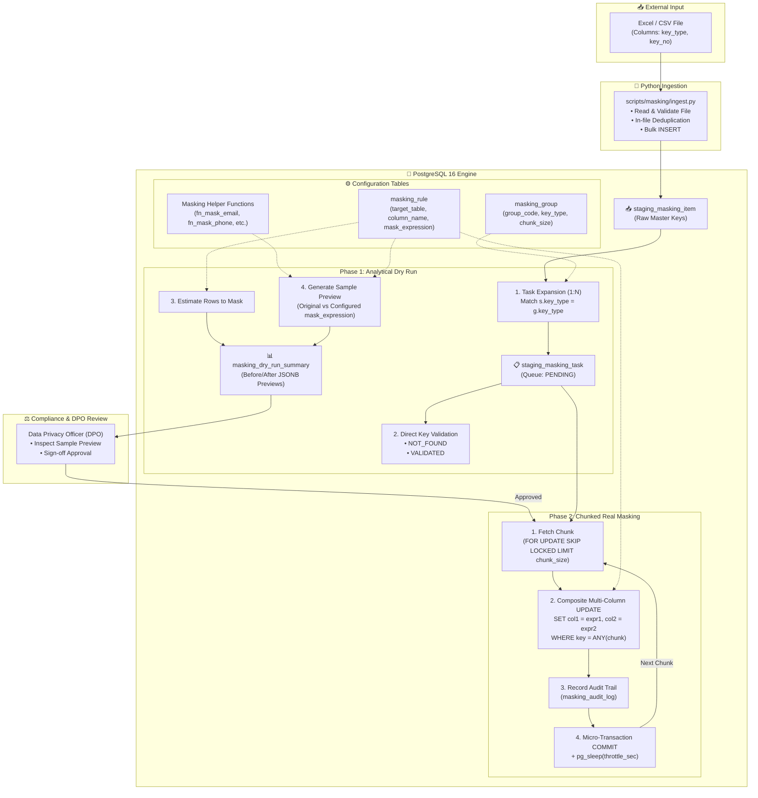
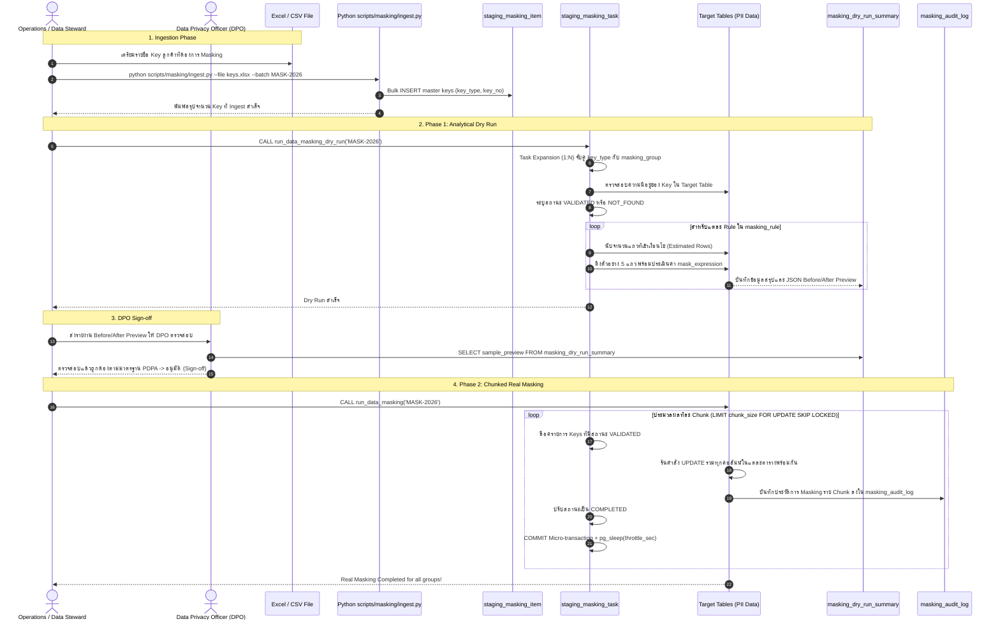
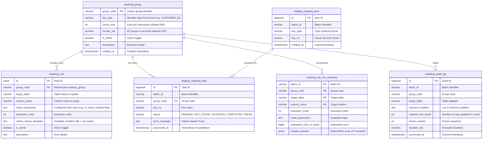

# Technical Specification: Key-Driven Data Masking System
### Version 1.0 | 2-Tier Item & Column Rule Architecture | PostgreSQL 16 | 2026-09-20

---

## 1. System Overview

ระบบ **Key-Driven Data Masking System** ได้รับการออกแบบขึ้นมาเพื่อทำหน้าที่แปลงข้อมูลอ่อนไหว (Personally Identifiable Information - PII / Sensitive Personal Data) ให้กลายเป็นข้อมูลที่ไม่สามารถระบุตัวบุคคลได้ตามข้อกำหนดทางกฎหมาย PDPA (พ.ร.บ. คุ้มครองข้อมูลส่วนบุคคล) และ GDPR (Right to Erasure / Pseudonymization) โดยยังคงรักษาโครงสร้างของแถวและ Foreign Key ไว้อย่างสมบูรณ์

### จุดเด่นเชิงสถาปัตยกรรม (Core Design Principles):
1. **Strictly Key-Driven Scope (จำกัดเฉพาะ Key ใน Excel/CSV)**:
   - ระบบจะไม่ทำการ Masking ข้อมูลแบบกวาดทั้งตาราง แต่จะประมวลผลเฉพาะระเบียนที่มีความเกี่ยวข้องกับ Key ที่นำเข้ามาจากไฟล์ภายนอกเท่านั้น (เช่น ลูกค้าเฉพาะรายที่ขอยกเลิกความยินยอม หรือลูกค้ารายที่หมดสัญญา)
   - ข้อมูลของลูกค้ารายอื่นๆ ที่ไม่อยู่ในไฟล์ Excel จะไม่ได้รับผลกระทบใดๆ ทั้งสิ้น
2. **Config-Table Driven Masking Logic (ตรรกะถูกควบคุมผ่านตารางคอนฟิก)**:
   - ตรรกะ สูตร หรือฟังก์ชันที่ใช้ในการแปลงข้อมูลแต่ละคอลัมน์ ถูกกำหนดอยู่ในคอลัมน์ `mask_expression` ของตาราง `masking_rule`
   - ผู้ดูแลระบบสามารถเปลี่ยนรูปแบบการ Masking ได้ทันทีผ่านการปรับค่าในตารางคอนฟิก โดยไม่ต้องแก้ไขโค้ด Stored Procedure
3. **2-Phase Safety Model with Before/After Sample Preview**:
   - **Phase 1 (Analytical Dry Run)**: ทำการตรวจสอบความมีอยู่ของ Key (VALIDATED vs NOT_FOUND), ประเมินจำนวนแถวที่จะได้รับผลกระทบ และดึงตัวอย่างข้อมูล **ก่อนแปลง (Before) เทียบกับ หลังแปลง (After)** บันทึกเป็น JSONB ลงใน `masking_dry_run_summary` เพื่อให้เจ้าหน้าที่คุ้มครองข้อมูลส่วนบุคคล (DPO) ตรวจสอบและลงนามอนุมัติ
   - **Phase 2 (Chunked Real Masking)**: ทำการ UPDATE ข้อมูลจริงแบบแบ่ง Chunk (เช่น 500 Keys ต่อ Micro-Transaction) พร้อม `COMMIT` และหน่วงเวลา `pg_sleep` เพื่อคืน I/O ให้กับฐานข้อมูล
4. **Zero-Deletion Referential Integrity**:
   - ไม่มีคำสั่ง `DELETE` ข้อมูลยังคงอยู่ในระบบครบถ้วนทุกตาราง ทำให้ระบบงานที่ต้องเชื่อมโยง Foreign Key หรือระบบรายงานทางสถิติยังคงสามารถทำงานต่อไปได้ตามปกติ

---

## 2. System Architecture



---

## 3. End-to-End Sequence Diagram



---

## 4. Entity-Relationship Diagram



---

## 5. Task State Machine

```
              ┌───────────────┐
              │    PENDING    │
              └───────┬───────┘
                      │
           Task Validation Phase
                      │
         ┌────────────┴────────────┐
         ▼                         ▼
   ┌───────────┐             ┌───────────┐
   │ NOT_FOUND │             │ VALIDATED │
   └───────────┘             └─────┬─────┘
                                   │
                      Phase 2: Real Masking
                                   │
                     ┌─────────────┴─────────────┐
                     ▼                           ▼
              ┌─────────────┐             ┌─────────────┐
              │  COMPLETED  │             │   FAILED    │
              └─────────────┘             └─────────────┘
```

| สถานะ | ความหมาย | การดำเนินการต่อ |
|---|---|---|
| `PENDING` | งานเพิ่งถูกขยายจาก `staging_masking_item` | รอการตรวจสอบความมีอยู่ของข้อมูล |
| `NOT_FOUND` | Key ที่นำเข้าจาก Excel ไม่ปรากฏในตารางเป้าหมาย | รายงานให้ Ops ตรวจสอบ ไม่นำไปรันใน Phase 2 |
| `VALIDATED` | Key มีอยู่จริงในตารางเป้าหมาย และพร้อมรับการ Masking | นำไปประมวลผลต่อใน Phase 2 |
| `COMPLETED` | ข้อมูลถูกแปลงค่าและ `COMMIT` สำเร็จเรียบร้อย | จบกระบวนการ |
| `FAILED` | เกิดข้อผิดพลาดระหว่างรัน (เช่น Data Type Overflow) | หยุดระบบและบันทึกข้อความ Error |

---

## 6. Comparison: Data Deletion vs Data Masking

| มิติการเปรียบเทียบ | ระบบ Data Deletion | ระบบ Data Masking |
|---|---|---|
| **คำสั่ง SQL หลัก** | `DELETE FROM table WHERE ...` | `UPDATE table SET col = expr WHERE ...` |
| **ผลลัพธ์ต่อข้อมูล** | แถวข้อมูลถูกลบถาวร (Hard Delete) | แถวข้อมูลยังคงอยู่ แต่ค่า PII ถูกบดบังถาวร |
| **ลำดับการประมวลผล** | **Bottom-Up** (ลูกสุด $\rightarrow$ แม่) ป้องกัน FK Error | **Grouped by Table** (รวมหลายคอลัมน์ใน 1 UPDATE) |
| **ความเสี่ยงด้าน Constraints** | ติด Foreign Key Violation หากไม่เรียงลำดับ | เสี่ยงต่อ Unique Index Collision หากใช้ค่าคงที่ |
| **การทำงานของ Dry Run** | นับจำนวนแถวที่คาดว่าจะถูกลบ | นับจำนวนแถว + **แสดงตัวอย่าง Before/After Value** |
| **การจัดการขอบเขตข้อมูล** | อ้างอิงตาม Excel Master Keys | อ้างอิงตาม Excel Master Keys |
| **การยืนยันความถูกต้อง** | ตรวจสอบว่า `COUNT(*)` ลดลงตามคาด | ตรวจสอบว่า PII กลายเป็น Masked String แต่ `COUNT(*)` เท่าเดิม |
